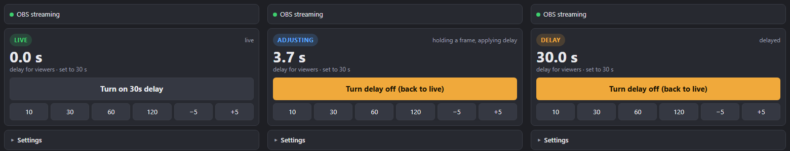
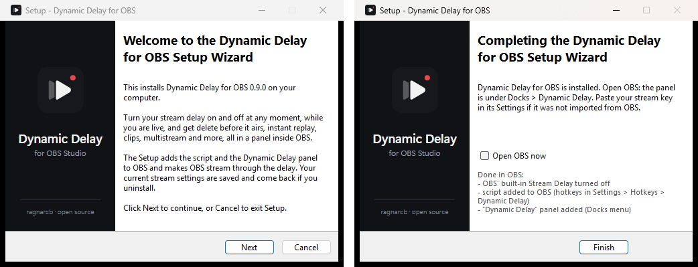
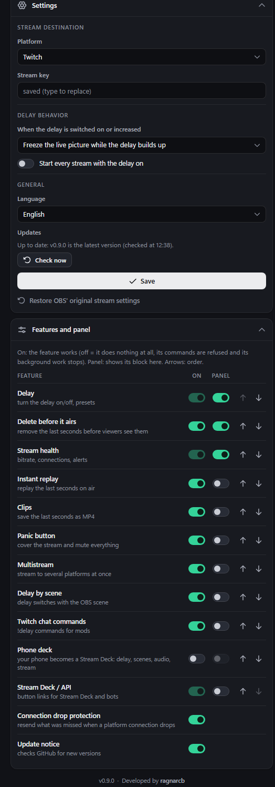
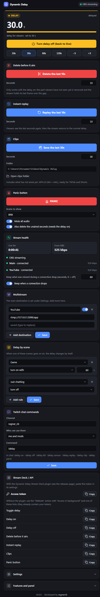
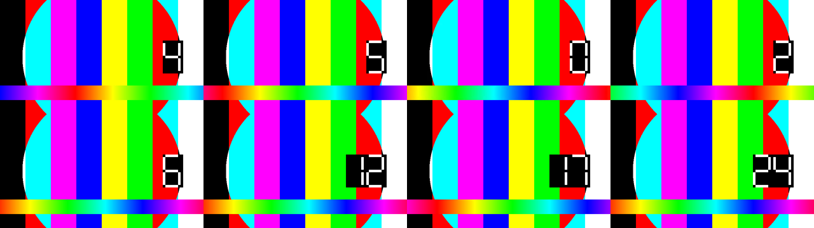
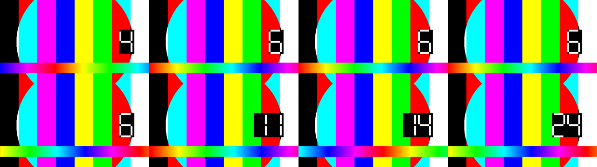
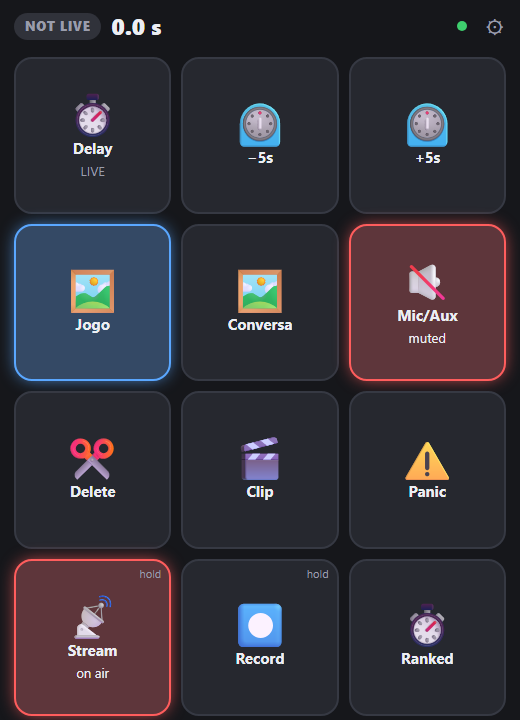

<p align="center"></p>

<h1 align="center">Delay dinámico para OBS</h1>

[English](README.md) · [Português](README.pt-BR.md) · **Español** · Desarrollado por [ragnarcb](https://github.com/ragnarcb) · **[Comunidad en Discord](https://discord.gg/crctbnQ2f8)**

Activa y desactiva el delay de tu transmisión **en cualquier momento, en pleno directo**, y obtén un kit de herramientas alrededor: borra lo que no debe salir al aire, repeticiones instantáneas, clips, multistream, protección contra caídas de conexión y más. Todo vive en un panel dentro de OBS que adaptas a lo que necesitas.



El "Retraso de transmisión" nativo de OBS solo se puede cambiar con la transmisión detenida. Con el Delay dinámico sales en directo como siempre y, cuando lo necesitas (spoilers, datos personales en pantalla, una partida competitiva), presionas un botón y la transmisión pasa a tener 30 s de delay. Lo presionas de nuevo y vuelve al directo, sin que la transmisión se caiga.

## Contenido

- [Funciones](#funciones)
- [Instalación](#instalación)
- [El panel](#el-panel)
- [Lo que ve el público](#lo-que-ve-el-público)
- [Funciones en detalle](#funciones-en-detalle)
- [Atajos](#atajos)
- [Stream Deck](#stream-deck)
- [Solución de problemas](#solución-de-problemas)
- [Actualizar y desinstalar](#actualizar-y-desinstalar)
- [Seguridad](#seguridad)
- [Cómo funciona](#cómo-funciona)
- [API](#api)
- [Desarrollo](#desarrollo)
- [Limitaciones conocidas](#limitaciones-conocidas)
- [Apoya el proyecto](#apoya-el-proyecto)
- [Licencia](#licencia)

## Funciones

**Delay**
- Activa y desactiva el delay en directo, con tus propios botones de presets (10, 30, 60, 120 s por defecto; muchos torneos de esports piden de 120 a 300 s) y pasos de ±5 s.
- **Apagado automático:** el delay se desactiva solo después de 15 a 120 minutos, para que no quede activo después de la partida clasificatoria.
- Tres formas de aplicarlo: **rebobinar** (sin congelar), mostrar una de tus **escenas de OBS** o **congelar** la imagen.
- **Delay por escena:** el delay cambia solo cuando una escena sale al aire (por ejemplo, activo en "Ranked", desactivado en "Charlando").

**Protección**
- **Borrar antes de salir al aire:** ¿se filtró una dirección, una contraseña o una notificación? Un toque quita los últimos segundos antes de que el público los vea.
- **Botón de pánico:** tapa la transmisión con una escena, silencia todo el audio y borra la parte que todavía no salió al aire, con un solo toque.

**Contenido y alcance**
- **Repetición instantánea** de los últimos segundos al aire, como una repetición deportiva.
- **Clips:** guarda los últimos segundos en MP4, listos para TikTok y Shorts.
- **Multistream:** Twitch, YouTube, Kick y cualquier destino RTMP/RTMPS a la vez, desde una sola salida de OBS.
- **Protección contra caídas de conexión:** si se cae la conexión con una plataforma, lo que no se pudo enviar se guarda y se envía al reconectar, así el público no se pierde nada.

**Control**
- Un **panel dentro de OBS** hecho de bloques: muestra solo lo que usas, en el orden que quieras, y minimiza los que casi no abres.
- **Cada función se puede desactivar de verdad**, no solo ocultar: una función desactivada no hace ningún trabajo.
- **Tu celular se vuelve un Stream Deck:** una cuadrícula de botones que diseñas tú (delay, borrar, replay, clip, pánico, escenas de OBS, silenciar fuentes de audio, iniciar/detener transmisión y grabación), iluminados según el estado del directo. Se abre con un código QR.
- **Atajos** de OBS, un **plugin para Stream Deck** y **comandos en el chat de Twitch** para ti y tus mods.
- **Widget en pantalla:** un indicador minimalista que muestra al público que el delay está activo y de cuántos segundos, con estilo, tema, textos, color y tamaño a elegir. Un clic lo agrega a OBS.
- **Salud de la transmisión:** bitrate de entrada, estado de cada destino y un pitido cuando se cae una conexión.
- **Inglés, portugués y español** en todas partes.

**Ligero:** no se recodifica nada. El relay solo guarda en búfer y reenvía el video que OBS ya codificó, con un uso de CPU insignificante.

## Instalación

> Requisitos: Windows 10/11 y OBS Studio 28 o más reciente, abierto al menos una vez.

**[Descargar Dynamic-Delay-Setup.exe](https://github.com/ragnarcb/obs-dynamic-delay/releases/latest/download/Dynamic-Delay-Setup.exe)** (siempre la última versión, inglés, portugués y español en un solo archivo).

1. Ejecútalo y elige el idioma. Windows puede mostrar "Windows protegió tu PC" mientras el programa es nuevo y todavía no tiene firma de código: haz clic en **Más información > Ejecutar de todas formas**.
2. Sigue el asistente (bienvenida, licencia, instalación). No se necesitan permisos de administrador: se instala para tu usuario de Windows. Si OBS está abierto, el instalador te pide cerrarlo (OBS reescribe su configuración al cerrarse).
3. La última página muestra lo que se hizo en OBS y ofrece abrir OBS.



El instalador:
- copia el relay y el script de OBS a `%APPDATA%\obs-dynamic-delay`;
- importa el destino y la clave de transmisión que ya estén configurados en OBS, si los hay;
- hace que OBS transmita a través del relay local (`rtmp://127.0.0.1:1935/live`) y desactiva el Retraso de transmisión nativo de OBS;
- agrega el script y el panel **Delay dinámico** a OBS;
- respalda cada archivo que cambia (`*.dd-backup` y `obs-service-backup.json`);
- agrega **Dynamic Delay for OBS** a **Configuración > Aplicaciones** de Windows, desde donde se desinstala limpiamente.

Cada versión publica el SHA-256 de sus archivos en `SHA256SUMS.txt`, para que puedas verificar la descarga (`Get-FileHash Dynamic-Delay-Setup.exe`).

En OBS, el panel está en **Docks > Delay dinámico**: arrástralo donde quieras, por ejemplo junto a "Controles". Si falta la clave de transmisión, el panel la pide en **Configuración**.

Haz primero una transmisión no listada o de prueba. La lista de verificación paso a paso está en [docs/TESTING.md](docs/TESTING.md).

## El panel

Cada función es un bloque. En **Funciones y panel** cada una tiene dos interruptores:

- **Activo:** la función trabaja. Desactivada significa que no hace nada: sus comandos se rechazan (panel, atajos, chat, Stream Deck), su trabajo en segundo plano se detiene y su bloque desaparece. Por ejemplo, con el chat desactivado el relay ni siquiera se conecta a Twitch; con el control desde el celular desactivado el panel no se abre a la red; con replay y clips desactivados no se usa memoria extra.
- **Panel:** muestra u oculta su bloque, y las flechas definen el orden. Una función activa pero oculta sigue funcionando con atajos, chat y Stream Deck.

Quien solo quiere el delay desactiva todo lo demás. El **Delay** en sí es el núcleo y siempre está activo. Los comandos de chat y el control desde el celular empiezan desactivados.



Por defecto el panel muestra **Delay**, **Borrar antes de salir al aire** y **Salud de la transmisión**. Con todos los bloques activados:



| Bloque | Para qué sirve |
|---|---|
| Delay | estado (EN DIRECTO, AJUSTANDO, DELAY, REPLAY, PÁNICO), retraso real para el público, activar/desactivar, presets |
| Borrar antes de salir al aire | quita los últimos segundos antes de que el público los vea |
| Repetición instantánea | repite al aire los últimos segundos |
| Clips | guarda los últimos segundos en MP4 y abre la carpeta de clips |
| Botón de pánico | escena de cobertura, silencio y borrado con un solo toque |
| Salud de la transmisión | tiempo en directo, bitrate desde OBS, estado y bitrate de cada destino, alcanzar después de una caída, pitido de alerta |
| Multistream | destinos extra con nombre, URL, clave e interruptor de activado/desactivado |
| Delay por escena | reglas: la escena X al aire activa el delay, lo desactiva o lo activa con N segundos |
| Comandos en el chat de Twitch | canal, quién puede usarlos, nombre del comando |
| Deck en el celular | código QR del deck para el celular y el editor de sus botones |
| Protección contra caídas de conexión (sin bloque) | interruptor en Funciones y panel; los segundos guardados se ajustan en Salud de la transmisión |
| Aviso de actualización (sin bloque) | interruptor en Funciones y panel |
| Stream Deck / API | token de acceso para el plugin y enlaces listos |
| Configuración (siempre visible) | plataforma, URL, clave, lo que ve el público cuando se activa el delay, empezar cada transmisión con el delay activo, idioma |

## Lo que ve el público

Para que la transmisión vaya 30 s atrasada, el público tiene que "perder" 30 s en algún momento. Tú eliges cómo, en **Configuración > Al activar o aumentar el delay**:

| Modo | Lo que ve el público cuando se activa el delay |
|---|---|
| **Rebobinar** (predeterminado) | La transmisión salta 30 s atrás **al instante** y sigue reproduciéndose, sin congelarse y sin cortes de audio. El público vuelve a ver los últimos 30 s. |
| **Mostrar una escena de OBS** | OBS cambia brevemente a la escena elegida (por ejemplo una imagen de "Aplicando delay..."), y esa imagen queda en pantalla, fija y sin sonido, mientras el delay se llena. Luego OBS vuelve solo a tu escena. |
| **Congelar la imagen** | La imagen del directo se congela en el siguiente keyframe, con el audio silenciado, mientras el delay se llena. |

En todos los modos:

| Acción | Lo que ve el público |
|---|---|
| **Desactivar el delay** | Un corte directo al presente: la parte en búfer se descarta y la transmisión vuelve al directo (en unos 2 s). |
| **Aumentar / disminuir** | Al aumentar se aplica el modo elegido solo para la diferencia; al disminuir se corta la diferencia. |
| **Terminar la transmisión con el delay activo** | El relay termina de enviar la cola con delay y solo entonces finaliza la transmisión en la plataforma. Para terminar de inmediato, desactiva el delay después de detener. |

- **Rebobinar:** el relay siempre guarda los últimos segundos que envió (unos 23 MB para 30 s a 6 Mbps). Si la transmisión empezó hace menos tiempo que el delay, rebobina lo que tiene y congela el resto. El salto ocurre en un keyframe, así que puede retroceder hasta 1 s más de lo pedido.
- **Mostrar una escena:** la escena se ve en directo hasta 2 s (hasta el siguiente keyframe) antes de quedar fija. Los videos y animaciones de la escena no se reproducen. Si la escena no existe o el script de OBS no responde, el relay congela la imagen del directo en su lugar.

Pruebas reales de salida (los números son segundos del video de origen):

**Rebobinar:** en el segundo 6 la transmisión salta al 0 y sigue con delay, luego corta al 24 cuando se desactiva el delay.



**Congelar:** se queda en el 6 mientras el delay se llena, sigue con delay y luego corta al 24.



## Funciones en detalle

### Borrar antes de salir al aire

Con el delay activo, lo que hiciste en los últimos segundos todavía no llegó al público. Presiona **Borrar** (bloque, atajo, chat `!delay censor` o Stream Deck) y los segundos más recientes (10 por defecto) se quitan del búfer. El público ve la transmisión mantener su último cuadro, sin sonido, en el hueco, y luego continúa. El delay sigue igual. La parte borrada tampoco va a los clips.

### Repetición instantánea

Repite al aire los últimos segundos (10 por defecto) y luego vuelve al delay normal. Funciona con o sin el delay activo.

### Clips

Guarda los últimos segundos (30 por defecto, hasta 120) como `clip_<fecha>.mp4` en `Videos\Dynamic Delay` o en la carpeta que elijas en el bloque. Por defecto incluye lo que todavía no salió al aire, para que puedas recortar algo que acaba de pasar; activa **Solo lo que el público ya vio** para dejar fuera la parte que sigue en el delay. H.264 + AAC se guarda en MP4; otros códecs (HEVC, AV1) se guardan en FLV.

Los clips copian la transmisión cuadro por cuadro, sin recodificar: tienen el **mismo tamaño y los mismos FPS que la transmisión**, que se muestran arriba en el bloque. Si OBS funciona a 30 FPS, los clips son de 30 FPS. En ese caso el bloque ofrece **Cambiar OBS a 60 FPS** (Configuración > Video > Valores comunes de FPS; solo con la transmisión y la grabación detenidas). El MP4 tiene FPS constantes (exactamente 60/1, 30/1, 59,94...), algo que editores de video como CapCut y Premiere manejan bien.

| Opción de clip | Qué hace |
|---|---|
| Duración | 15 / 30 / 60 / 90 / 120 s, o cualquier valor de 5 a 120 |
| Solo lo que el público ya vio | termina el clip donde está el público, no en el momento en directo |
| Carpeta de clips | dónde se guardan los archivos (vacío = `Videos\Dynamic Delay`) |
| Cambiar OBS a 60 FPS | aparece cuando OBS funciona por debajo de 50 FPS |

### Botón de pánico

Un toque: cambia OBS a la escena de pánico (por ejemplo "Ya vuelvo"), silencia todas las fuentes de audio y, con el delay activo, borra los segundos que todavía no salieron al aire. Presiona de nuevo para volver: regresa la escena anterior y solo se reactivan las fuentes que el pánico silenció.

### Multistream

Transmite a Twitch, Kick, YouTube, Facebook o cualquier servidor RTMP(S) a la vez. Agrega destinos en el bloque **Multistream**: elige la plataforma (la dirección del servidor se completa sola), pega la clave y elige si **inicia junto con la transmisión**.

En directo, **Destinos ahora** muestra cada destino con su estado y bitrate y un botón **Entrar en directo** / **Detener**: cada uno inicia o se detiene por su cuenta, sin tocar los demás ni OBS. Los cambios de configuración se aplican al instante: un destino nuevo entra en directo (si está configurado para iniciar con la transmisión), uno eliminado se detiene, una clave o dirección cambiada se reconecta. Un destino iniciado a mitad de la transmisión empieza limpio en un keyframe. El deck en el celular también tiene un botón para esto (**Multistream: iniciar/detener un destino**, mantén presionado para confirmar).

Cada destino recibe la misma transmisión con delay por su propia conexión, y un problema en uno no afecta a los demás. Tu subida tiene que soportar el bitrate una vez por destino (dos a 6000 kbps necesitan unos 12 Mbps).

### Protección contra caídas de conexión

Cuando se cae la conexión con una plataforma, el relay guarda lo que no se pudo enviar (hasta 60 s por defecto, ajustable en **Salud de la transmisión**) y lo envía al reconectar, en tiempo real. El público de esa plataforma no se pierde nada; ese destino queda entonces atrasado ese tiempo, y el botón **Alcanzar** lo pone al día. En una red demasiado lenta para el bitrate, el relay salta hacia adelante en lugar de usar cada vez más memoria.

### Delay por escena

Reglas como "**Ranked** al aire: activar con 60 s" y "**Charlando**: desactivar". La escena a la que cambian el modo de delay y el botón de pánico nunca dispara reglas.

### Comandos en el chat de Twitch

Actívalos en **Funciones y panel** y escribe el nombre de tu canal en el bloque **Comandos en el chat de Twitch** (solo el nombre, un enlace `twitch.tv/...` también funciona). El relay lee el chat de forma anónima (sin login, sin token) y solo acepta comandos tuyos, de tus mods o también de los VIP:

`!delay on` · `!delay off` · `!delay 60` (activa con 60 s) · `!delay 60 20m` (activo con 60 s durante 20 minutos) · `!delay timer 20` / `!delay timer off` · `!delay censor [s]` · `!delay replay [s]` · `!delay clip [s]` · `!delay panic`.

Los comandos en inglés funcionan siempre. Además se aceptan palabras en el idioma del panel. Con el idioma en español: `encender` / `activar`, `apagar` / `desactivar`, `alternar`, `borrar` / `censurar`, `repetir`, `temporizador`, `pánico`. En portugués (y en inglés, como siempre): `ligar`, `desligar`, `apagar` (borrar), `clipe`, `panico`. Ojo: `apagar` significa "borrar" en portugués pero "desactivar" en español, por eso depende del idioma configurado.

### Deck en el celular

Tu celular (o una tablet, o un segundo monitor) se vuelve un Stream Deck: una cuadrícula a pantalla completa de botones grandes, iluminados según el estado del directo.



1. Activa **Deck en el celular** en **Funciones y panel**.
2. Escanea el código QR de su bloque con la cámara del celular (misma red Wi-Fi). Windows puede pedir que permitas la conexión la primera vez. Consejo: agrega la página a la pantalla de inicio para abrirla como una app.
3. Diseña los botones en el mismo bloque: acción, objetivo (escena, fuente de audio o segundos), texto, color, orden y número de columnas, y luego **Guardar**. El celular toma el nuevo diseño solo.

| Acción del botón | Qué hace | Se ilumina cuando |
|---|---|---|
| Delay: activar/desactivar / activar / desactivar / activar con N s / ±N s | controla el delay | el delay está activo (muestra los segundos) |
| Borrar antes de salir al aire, Repetición instantánea, Guardar clip | lo mismo que los bloques | hay una repetición |
| Botón de pánico | pánico activado/desactivado | el pánico está activo |
| Alcanzar después de una caída | descarta el atraso acumulado de un destino | un destino está atrasado |
| OBS: cambiar a la escena | pone esa escena al aire | la escena está al aire |
| OBS: silenciar/activar fuente de audio | alterna un micrófono, el audio del escritorio, la música... | la fuente está silenciada |
| OBS: iniciar/detener transmisión o grabación | **mantén** el botón para confirmar | transmitiendo / grabando |

Los botones vibran al presionarlos y tiemblan si algo falló. El enlace lleva el token de acceso: cualquiera que lo tenga puede controlar tu transmisión, así que no lo compartas. En la PC, "Abrir el deck en esta PC" abre el mismo deck en el navegador.

### Widget en pantalla

Un pequeño indicador en tu transmisión que le dice al público que el delay está activo, y de cuántos segundos. Minimalista por defecto, y cada parte se puede cambiar.


1. Activa **Widget en pantalla** en **Funciones y panel** (activo por defecto) y abre su bloque.
2. Presiona **Agregar a la escena actual de OBS**: el script de OBS crea una fuente de navegador llamada "Dynamic Delay overlay" arriba a la izquierda. Muévela y cambia su tamaño como cualquier fuente. O copia el enlace (`http://127.0.0.1:8787/overlay`) en una fuente de navegador tú mismo.
3. Personalízalo en el mismo bloque, con vista previa en vivo (los botones debajo de la vista previa muestran cada estado):

| Ajuste | Opciones |
|---|---|
| Estilo | píldora, tarjeta (segundos grandes), solo texto |
| Tema | oscuro, claro, contorno |
| Mostrar | punto, texto, segundos, línea de progreso (cada uno activable) |
| Textos | tus propias palabras para activo, ajustando, replay y desactivado (vacío = predeterminado) |
| Además | color, tamaño (50 a 300%), alineación, fuente (sans, mono, condensada), tiempo como `30s` o `0:30`, ocultar mientras el delay está desactivado |

Estados: **Delay** (punto rojo) mientras el público va atrasado, **Ajustando** (ámbar, con la línea de progreso) mientras el delay se llena o vuelve al directo, **Replay** (azul) durante una repetición instantánea. Sin transmisión muestra el delay configurado, para que lo ubiques y ajustes en OBS antes de salir en directo (desmarca "Mostrarlo también sin transmisión" para ocultarlo, por ejemplo al grabar). En directo, se oculta mientras el delay está desactivado, a menos que desactives esa opción.

Los cambios se aplican en la transmisión al instante. Para un segundo estilo en otra escena, agrega parámetros al enlace, con los mismos nombres que los ajustes: `?style=minimal&scale=150&show_label=0&accent=22c55e`. El campo CSS personalizado de la fuente de navegador también funciona. La página es de solo lectura y no necesita token: solo muestra el estado del delay.

### Eventos push para bots

Bots como Streamer.bot, SAMMI o Advanced Scene Switcher pueden escuchar `/api/events` (Server-Sent Events, token en `?token=` o en el encabezado `x-dd-token`) y recibir un evento JSON en cada cambio: `delay_on` / `delay_off`, `delay_seconds`, `phase`, `replay_start` / `replay_end`, `censor`, `clip_saved`, `panic_on` / `panic_off`, `destination`, `auto_off_timer` y `auto_off`. El flujo empieza con una instantánea `hello` y envía un keep-alive cada 15 s.

```
event: delay_off
data: {"type":"delay_off","delay_seconds":60,"ts":1790481858596}
```

## Atajos

En **Configuración > Atajos**, busca "Delay dinámico":

| Atajo | Qué hace |
|---|---|
| activar/desactivar | alterna entre directo y con delay |
| activar / desactivar (volver al directo) | define el estado del delay |
| aumentar / disminuir | suma o quita 5 s (el paso se ajusta en las opciones del script) |
| borrar antes de salir al aire | quita los segundos más recientes que todavía no salieron al aire |
| repetición instantánea | repite los últimos segundos |
| guardar clip | guarda los últimos segundos en MP4 |
| botón de pánico | modo pánico activado / desactivado |

## Stream Deck

**Plugin (experimental):** descarga `Dynamic-Delay-StreamDeck.streamDeckPlugin` de las releases y haz doble clic. Arrastra las acciones "Dynamic Delay" a tus botones; en la configuración de cualquiera de ellas pega el token de acceso del bloque **Stream Deck / API** del panel. El botón de alternar muestra LIVE o DELAY con los segundos actuales, y el botón de pánico muestra ON mientras está activo.


El plugin se probó con un Stream Deck simulado, todavía no en hardware real: por favor reporta cualquier problema.

**Sin el plugin:** usa la acción "Website" con "Access in background" y uno de los enlaces del bloque **Stream Deck / API** (ya incluyen tu token).

## Solución de problemas

¿Sigues atascado? Pregunta en el [servidor de Discord](https://discord.gg/crctbnQ2f8) (#suporte) o abre un issue en GitHub.

| Síntoma | Qué hacer |
|---|---|
| `[obs-dynamic-delay.lua] Error opening file: (null)` | OBS sigue haciendo referencia a un script que falta, por ejemplo tras una desinstalación incompleta. Ver [Desinstalar de la forma correcta](#desinstalar-de-la-forma-correcta). |
| El panel muestra **RELAY CERRADO** | Es normal mientras OBS está iniciando. Si sigue así, abre **Herramientas > Scripts**, verifica que `obs-dynamic-delay.lua` esté en la lista y haz clic en "Reiniciar relay". |
| El panel dice que falta el token de acceso | Ábrelo desde OBS (menú Docks) o con el botón "Abrir panel" del script, no escribiendo la dirección. |
| **Plataforma RECONECTANDO** con un error | Casi siempre es una clave o URL incorrecta. Revisa **Configuración**. |
| **OBS sin configurar** | Haz clic en **Configurar OBS automáticamente** en el panel. |
| OBS no se puede conectar al servidor | El relay no se inició. Revisa `%APPDATA%\obs-dynamic-delay\obs-dynamic-delay.log`. |
| El panel no aparece | **Docks > Delay dinámico**. Si no está, vuelve a ejecutar el instalador con OBS cerrado. |
| "Windows protegió tu PC" | El exe no tiene firma de código. Haz clic en **Más información > Ejecutar de todas formas**. |
| Los comandos del chat no hacen nada | Activa **Comandos en el chat de Twitch** en **Funciones y panel** y escribe el nombre del canal en su bloque. El log (`obs-dynamic-delay.log`) debe mostrar `[chat] joined #tucanal`. |
| El público solo recibe 720p (o la transmisión se traba) | OBS estaba enviando más de lo que la plataforma acepta. Con el servicio de Twitch/Kick, OBS limita el encoder solo; con el relay (un servidor personalizado) el script de OBS ahora hace lo mismo: límite de bitrate (Twitch 6000, Kick 8000 kbps) y un keyframe cada 2 s, manteniendo tu 1080p. Se aplica cuando el script se carga y en cada inicio de transmisión, y se omite si "Aplicar la configuración del servicio" está desactivado (Avanzado) o si "Ignorar las recomendaciones del servicio de streaming" está activado (Simple). El panel avisa en directo si OBS está por encima del límite. |
| El celular no puede abrir el deck | Misma red Wi-Fi, permite la conexión en el aviso del firewall de Windows y usa el enlace del código QR. |
| Un botón del deck para escenas o audio no hace nada | El script de OBS debe estar ejecutándose (el deck muestra un punto rojo cuando no puede llegar al relay); revisa el nombre de la escena o de la fuente en el editor. |
| Quiero volver a transmitir sin el relay | **Configuración > Restaurar la configuración de transmisión original de OBS** (haz clic dos veces para confirmar). |

Al abrir un issue, adjunta `obs-dynamic-delay.log`. Las claves de transmisión no se escriben en él.

## Actualizar y desinstalar

El relay busca una versión nueva en GitHub al iniciar, cada 6 horas y cuando haces clic en **Buscar ahora** (Configuración > General > Actualizaciones, que también muestra "al día" y la hora de la última verificación). Una versión nueva muestra un banner en el panel, un aviso y una línea en el estado del script en OBS (Herramientas > Scripts). Con el **Aviso de actualización** desactivado en Funciones y panel, no se hace ninguna conexión. Para actualizar, ejecuta el nuevo `Dynamic-Delay-Setup.exe`: se instala sobre la versión anterior y conserva tu configuración y tus claves. Para desinstalar, mira [Desinstalar de la forma correcta](#desinstalar-de-la-forma-correcta) más abajo. El instalador también acepta las opciones habituales de Inno Setup (`/SILENT`, `/VERYSILENT`, `/LANG=en|pt|es`).

### Desinstalar de la forma correcta

> [!WARNING]
> **No uses Geek Uninstaller, Revo, IObit ni herramientas similares.** Usa **Configuración > Aplicaciones > Dynamic Delay for OBS** de Windows (o menú Inicio > Dynamic Delay for OBS > Desinstalar). Borrar la carpeta o usar una limpieza forzada que omita el desinstalador puede dejar OBS apuntando a archivos ausentes y un relay que ya no existe.
>
> Si la restauración falla, el desinstalador ofrece **Desinstalar de todos modos y conservar los archivos de recuperación**. OBS puede seguir apuntando al relay eliminado; restaura el servicio manualmente con las copias de los perfiles y la configuración conservada. La desinstalación silenciosa se cancela por defecto. En el auxiliar, `--uninstall --quiet --force` permite recuperación incompleta y conserva las copias cuando falla la restauración; si termina correctamente, limpia los archivos de recuperación como en una desinstalación normal. No elimina el programa ni omite la comprobación de OBS abierto.

Si OBS está abierto, la desinstalación se detiene antes de borrar el programa. Si la restauración falla, se detiene salvo que elijas explícitamente desinstalar de todos modos. Cierra OBS y vuelve a intentarlo; `setup.log` en la carpeta de instalación indica el error. Conserva los archivos de recuperación hasta completar el nuevo intento.

1. Cierra OBS.
2. **Configuración > Aplicaciones > Aplicaciones instaladas > Dynamic Delay for OBS > Desinstalar** de Windows.
3. Después de una desinstalación correcta, abre OBS. La aplicación restaura los ajustes que cambió:
   - tu servicio de transmisión (Twitch, Kick, YouTube...) con la cuenta conectada;
   - el retraso de transmisión propio de OBS;
   - el bitrate y el intervalo de keyframe, si el script los había ajustado a la plataforma;
   - el script y el panel salen de todos los perfiles y colecciones de escenas.
   Un valor que cambiaste tú después de instalar se mantiene.

Los cambios nuevos se registran por campo y por perfil. En instalaciones antiguas que solo guardaron el archivo completo del codificador, se conservan los valores ambiguos de bitrate/keyframe sin adivinar su origen; el archivo `.dd-backup` permanece en el perfil de OBS para recuperación manual.

**¿Ya lo borraste con otro programa?** Arregla OBS a mano:
1. **Herramientas > Scripts:** selecciona `obs-dynamic-delay.lua` (muestra el error `Error opening file: (null)`) y pulsa **−** para quitarlo.
2. **Configuración > Emisión:** elige tu plataforma otra vez en lugar de "Personalizado" y pulsa **Conectar cuenta** (o pega tu clave).
3. **Paneles > Paneles de navegador personalizados:** quita "Delay dinámico".
4. **Configuración > Salida:** revisa el bitrate y, en Twitch, la **pista de audio del VOD** si la usas.
O instala Dynamic Delay otra vez y desinstálalo de la forma correcta.

## Seguridad

- Cada llamada a la API necesita el token de acceso creado en el primer inicio (`api_token` en `config.toml`). Los sitios web abiertos en tu navegador no pueden controlar el delay ni leer tu configuración.
- La API nunca devuelve las claves de transmisión ni el token. La página del widget en pantalla (`/overlay`) es lo único sin token: es de solo lectura y muestra el estado del delay y nada más.
- Por defecto el panel solo escucha en tu PC (`127.0.0.1`). El **deck en el celular** (desactivado por defecto) lo abre a tu red local, protegido igualmente por el token. Un botón del deck solo ejecuta la acción guardada para él en el editor.
- Las funciones que desactivas no hacen nada: sin conexión al chat, sin puerto en la red local, sin búferes extra.
- El relay solo abre unos pocos lugares fijos en tu PC cuando se le pide (el GitHub del autor, la página de releases, la sección de apoyo, la invitación de Discord, la carpeta de clips).

## Cómo funciona

```
                  ┌──────────────────── obs-dynamic-delay (relay) ────────────────────┐
OBS ──RTMP──▶ 127.0.0.1:1935 ──▶ delay engine ──▶ one RTMP/RTMPS client per destination ──▶ Twitch / YouTube / Kick
 ▲                                  │   ▲                      (own buffer: drops, slow networks)
 │ Lua script (hotkeys, scenes,     │   └── HTTP 8787 + token ◀── dock panel · phone · Stream Deck
 │ panic, OBS settings) ◀── UDP 8788┘                  ▲
 └────────────────────────────────── clips (MP4) ◀─────┘         Twitch chat (IRC, read only)
```

- **Relay (Rust, `src/`):** recibe RTMP de OBS, guarda los paquetes ya codificados y los reenvía con el delay actual.
  - Aumentar el delay: rebobinar vuelve a poner en la cola los paquetes enviados hace poco; escena y congelar repiten un keyframe (más audio AAC en silencio) hasta llenar el búfer.
  - Disminuir corta en el keyframe más reciente posible; borrar descarta los paquetes más nuevos que no salieron al aire y mantiene el último cuadro en el hueco.
  - Las marcas de tiempo se reescriben para que cada plataforma reciba una línea de tiempo continua, B-frames incluidos.
- **Script de OBS (Lua, `obs/`):** atajos, inicia y cierra el relay con OBS, informa la escena al aire y aplica dentro de OBS lo que pide el relay (configuración de transmisión, escena de delay, pánico). Usa el LuaJIT incluido en OBS, así que no hace falta instalar Python.
- **Panel (`src/panel.html`):** el relay lo escribe como `dock.html` con el token, y se carga como un dock de OBS.
- **Instalador (`src/installer.rs`):** el mismo exe; con doble clic, configura OBS.

**Por qué Rust:** el trabajo pesado es un servidor RTMP y varios clientes que guardan minutos de video en memoria y reenvían todo en el momento justo durante horas. Rust lo entrega como un solo `.exe` sin dependencias, sin pausas de recolector de basura y con un uso de CPU casi nulo.

## API

`http://127.0.0.1:8787`, token en el encabezado `x-dd-token` o en el parámetro `?token=`. GET y POST funcionan para los comandos, así Stream Deck y los bots pueden usarlos directamente.

| Ruta | Acción |
|---|---|
| `/api/cmd/{cmd}` · `/api/cmd/{cmd}/{arg}` | `toggle`, `on`, `off`, `set/30`, `add/-5`, `censor[/s]`, `replay[/s]`, `clip[/s]`, `panic`, `catchup`, `autooff/20` (0 = cancelar), `onfor/20` (activo durante 20 min) |
| `/api/events` | eventos push (Server-Sent Events), ver [Eventos push para bots](#eventos-push-para-bots) |
| `/api/status` | estado en JSON (delay, motor, destinos, salud, pánico, último clip, eventos) |
| `/api/config` | lee (GET) o cambia (POST JSON, solo los campos que envíes) la configuración |
| `/api/obs/configure` · `/api/obs/restore` | pide al script de OBS que configure o restaure la configuración de transmisión |
| `/api/update/check` | busca ahora una versión nueva en GitHub |
| `/api/output/{id}/{start,stop,toggle}` | inicia o detiene un destino de la transmisión en curso (ids en `/api/status` > `outputs`) |
| `/api/obs/fps/{n}` | pide al script de OBS que ajuste los FPS de OBS (24, 25, 30, 48, 50 o 60) |
| `/api/lan` | enlace y código QR del deck en el celular |
| `/deck` · `/api/deck/press/{n}` | página del deck en el celular · ejecuta el botón número n |
| `/api/obs/overlay` | pide al script de OBS que agregue el widget en pantalla a la escena actual |
| `/overlay` · `/overlay/state` | página del widget en pantalla y su estado (sin token: solo lectura, solo el estado del delay) |

El puerto UDP `8788` acepta los mismos comandos como texto (`toggle`, `set 30`, `censor`, ...) más los que usa el script de OBS.

## Desarrollo

Requiere [Rust](https://rustup.rs) estable. La prueba de extremo a extremo también necesita `ffmpeg` y `curl` en el PATH.

```sh
cargo build --release                  # target/release/obs-dynamic-delay.exe (inglés)
cargo build --release --features pt    # igual, con portugués por defecto
cargo test                             # motor, FLV, clips, configuración, chat, instalador, comandos
bash scripts/e2e-test.sh               # ffmpeg hace de OBS y de la plataforma
```

Ejecutar solo el relay: `obs-dynamic-delay.exe ruta\config.toml`. Probar el instalador sin tocar tu OBS: `DD_OBS_CONFIG_DIR`, `DD_INSTALL_DIR`, `DD_SKIP_OBS_CHECK=1`.

| Archivo | Contenido |
|---|---|
| `src/engine.rs` | motor de delay: búfer, rebobinar, congelar, cortes, borrar, replay, instantánea para clips, marcas de tiempo |
| `src/upstream.rs` | un cliente RTMP/RTMPS por destino, búfer para caídas, alcanzar |
| `src/ingest.rs` | servidor RTMP que recibe de OBS |
| `src/control.rs` | API HTTP (token, red local, QR) y comandos UDP |
| `src/clip.rs` | escritor de clips MP4/FLV |
| `src/chat.rs` | comandos en el chat de Twitch |
| `src/installer.rs` | instalador con ventanas y de consola |
| `src/i18n.rs` | textos en inglés, portugués y español (macro `t!`) |
| `src/panel.html` | panel; cada bloque es una entrada en `MODULES`, textos en `TEXT` |
| `src/deck.html` | deck en el celular |
| `src/overlay.html` | widget en pantalla (fuente de navegador) |
| `obs/obs-dynamic-delay.lua` | script de OBS (textos con `L()`) |
| `streamdeck/` | plugin para Stream Deck y su generador de íconos |

**Agregar un bloque al panel:** agrega su id a `ALL_MODULES` en `src/config.rs` y `src/panel.html`, escribe una entrada en `MODULES` (`build()` devuelve el contenido, `update(status)` lo actualiza) y sus textos en todos los idiomas.

**Publicar una versión:** sube `version` en `Cargo.toml` y en el `manifest.json` del plugin, actualiza `CHANGELOG.md` y luego:

```sh
git tag vX.Y.Z && git push origin vX.Y.Z   # el workflow Release compila y publica todo
```

El workflow (`.github/workflows/release.yml`) ejecuta las pruebas, compila `dist/Dynamic-Delay-Setup.exe` con `scripts/build_setup.ps1` (Inno Setup, `installer/setup.iss`), el plugin para Stream Deck y `SHA256SUMS.txt`, y publica la release con las notas de `release-notes/vX.Y.Z.md`. En local: `powershell -File scripts/build_setup.ps1` (requiere Inno Setup 6: `winget install JRSoftware.InnoSetup`).

**Firma de código:** `scripts/sign.ps1` firma el programa, el instalador y el desinstalador con Authenticode en cuanto exista un certificado: en local con `SIGN_PFX` / `SIGN_PFX_PASS`, en el workflow con los secretos del repositorio `SIGN_PFX_BASE64` / `SIGN_PFX_PASS`. Sin ellos la compilación funciona igual, sin firma.

## Limitaciones conocidas

- **Cuenta conectada:** con Dynamic Delay instalado, OBS transmite a un servidor personalizado (el relay), así que la conexión de la cuenta de Twitch/Kick y sus paneles no están disponibles en OBS. La **pista de audio del VOD** de Twitch sí funciona (OBS 30.2 o más nuevo): el instalador activa la opción de OBS que la muestra con servidor personalizado (**Configuración > Salida > Emisión**), y el relay la envía con el retraso. Haz un directo corto de prueba y revisa el VOD una vez después de activarla.
- Probado de extremo a extremo en local (ffmpeg como OBS y como las plataformas, un OBS y un Stream Deck simulados). Haz una transmisión de prueba en tu plataforma antes de una importante: [docs/TESTING.md](docs/TESTING.md).
- Solo RTMP/RTMPS. WHIP, SRT y la "Transmisión mejorada" (multipista) de Twitch no pasan por el relay.
- El delay cambia en los keyframes (unos 2 s con el intervalo predeterminado de OBS).
- El exe no tiene firma de código, así que Windows SmartScreen avisa en la primera ejecución.
- El instalador configura el perfil de OBS en uso y una instalación estándar (no portable) de OBS. Es para Windows; el relay y el script también funcionan en Linux y macOS con una configuración manual.

## Apoya el proyecto

El Delay dinámico es gratis y seguirá siéndolo. Si te ayuda en tus transmisiones y quieres apoyar su desarrollo, puedes enviar una donación en cripto. ¡Gracias!

<table>
<tr>
<td align="center"><br><b>Bitcoin (BTC)</b></td>
<td align="center"><br><b>Ethereum (ETH)</b></td>
<td align="center"><br><b>Solana (SOL)</b></td>
</tr>
</table>

| Red | Dirección |
|---|---|
| Bitcoin (BTC) | `bc1qvqtzjtfsrhucl4dkaj3hlc0x7h8lvm2252jars` |
| Ethereum (ETH) | `0x59398D8344bb6aB167DA68E1773096560Fab2258` |
| Solana (SOL) | `4Dn7niMomKZXmQKov8sKkknnCMMwmY4kDp6LejTrrDxJ` |

Envía solo la moneda de cada red a su dirección (BTC a la dirección de Bitcoin, ETH o ERC-20 en la red principal de Ethereum a la dirección de Ethereum, SOL a la dirección de Solana). Las transferencias cripto no se pueden deshacer: copia la dirección desde aquí o escanea el código QR, y revisa los primeros y últimos caracteres en tu billetera antes de enviar.

Darle una estrella al repositorio y contarles a otros streamers también ayuda mucho.

## Licencia

**El Delay dinámico se hizo para ser gratis.** Úsalo para lo que quieras, solo no lo vendas.

El código fuente del Delay dinámico es abierto bajo la [Licencia MIT con la Commons Clause](LICENSE). Puedes usarlo, copiarlo, modificarlo y compartirlo, incluso en tus propias transmisiones y proyectos, siempre que **des el crédito correspondiente**: conserva el aviso de copyright (`Copyright (c) 2026 ragnarcb`) y el texto de la licencia en las copias y obras derivadas, y menciona a [ragnarcb](https://github.com/ragnarcb) como autor original.

Lo único que **no** puedes hacer es **venderlo**: no puedes cobrar por el software en sí, ni por un producto o servicio cuyo valor venga principalmente de él (incluido hosting o soporte pago para él). Usarlo en tus propias transmisiones está bien, incluidas las monetizadas: eso es usar el programa, no venderlo.

Las contribuciones son bienvenidas: abre un issue o un pull request.

---

Desarrollado por [ragnarcb](https://github.com/ragnarcb).
