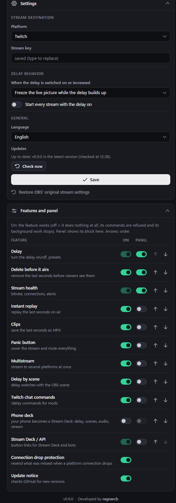
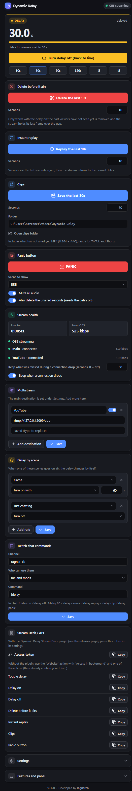
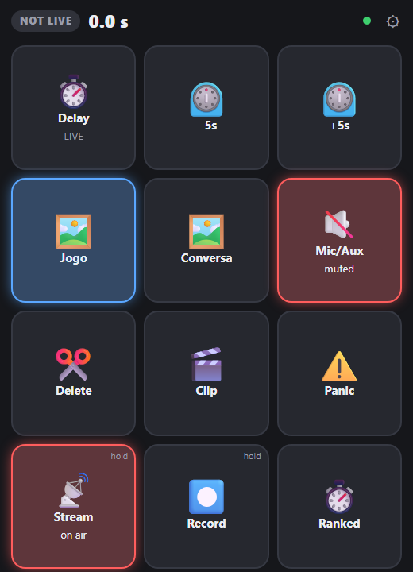

# Dynamic Delay for OBS

**English** · [Português](README.pt-BR.md) · Developed by [ragnarcb](https://github.com/ragnarcb)

Turn your stream delay on and off **at any moment, while you are live**, and get a toolkit around it: delete what should not air, instant replays, clips, multistream, protection against connection drops, and more. Everything lives in a panel inside OBS that you shape to your needs.


OBS' built-in "Stream Delay" can only be changed while the stream is stopped. With Dynamic Delay you go live as usual and, whenever you need it (spoilers, personal info on screen, a competitive match), you press a button and the stream becomes 30 s delayed. Press it again and it is back to live, without the stream dropping.

## Contents

- [Features](#features)
- [Installation](#installation)
- [The panel](#the-panel)
- [What viewers see](#what-viewers-see)
- [Features in detail](#features-in-detail)
- [Hotkeys](#hotkeys)
- [Stream Deck](#stream-deck)
- [Troubleshooting](#troubleshooting)
- [Updating and uninstalling](#updating-and-uninstalling)
- [Security](#security)
- [How it works](#how-it-works)
- [API](#api)
- [Development](#development)
- [Known limitations](#known-limitations)
- [License](#license)

## Features

**Delay**
- Switch the delay on and off while live, presets (10, 30, 60, 120 s) and ±5 s steps.
- Three ways to apply it: **rewind** (no freeze), show one of your **OBS scenes**, or **freeze** the picture.
- **Delay by scene:** the delay switches by itself when a scene goes on air (for example on in "Ranked", off in "Just chatting").

**Protection**
- **Delete before it airs:** leaked an address, a password or a notification? One press removes the last seconds before viewers see them.
- **Panic button:** covers the stream with a scene, mutes all audio and deletes the unaired part, in one press.

**Content and reach**
- **Instant replay** of the last seconds on air, like a sports replay.
- **Clips:** saves the last seconds as MP4, ready for TikTok and Shorts.
- **Multistream:** Twitch, YouTube, Kick and any RTMP/RTMPS destination at the same time, from a single OBS output.
- **Connection drop protection:** if a platform connection drops, what could not be sent is kept and sent after it reconnects, so viewers miss nothing.

**Control**
- A **panel inside OBS** made of blocks: show only what you use, in the order you want.
- **Every feature can be switched off for real**, not just hidden: an off feature does no work at all.
- **Your phone becomes a Stream Deck:** a grid of keys you design (delay, delete, replay, clip, panic, OBS scenes, mute audio sources, start/stop streaming and recording), lit with the live state. Open it with a QR code.
- OBS **hotkeys**, a **Stream Deck plugin** and **Twitch chat commands** for you and your mods.
- **Stream health:** input bitrate, per destination status, and a beep when a connection drops.
- **English and Portuguese** everywhere.

**Lightweight:** nothing is re-encoded. The relay only buffers and forwards the video OBS already encoded, with negligible CPU use.

## Installation

> Requirements: Windows 10/11 and OBS Studio 28 or newer, opened at least once.

1. From the [Releases](../../releases/latest) page, download **`Dynamic-Delay-Installer.exe`** (English). `Instalar-Delay-Dinamico.exe` is the Portuguese version; the language can be changed later in the panel.
2. Double-click it. Windows may show "Windows protected your PC" because the exe is not code-signed: click **More info > Run anyway**.
3. Click **Yes** to install. If OBS is open, the installer asks you to close it (OBS rewrites its settings when it closes).
4. When it is done, the installer shows everything it did and offers to open OBS.

The installer:
- copies the relay and the OBS script to `%APPDATA%\obs-dynamic-delay`;
- imports the destination and stream key already set in OBS, when there are any;
- makes OBS stream through the local relay (`rtmp://127.0.0.1:1935/live`) and turns off OBS' built-in Stream Delay;
- adds the script and the **Dynamic Delay** panel to OBS;
- backs up every file it changes (`*.dd-backup` and `obs-service-backup.json`).

In OBS, the panel is under **Docks > Dynamic Delay**: drag it wherever you like, for example next to "Controls". If the stream key is missing, the panel asks for it under **Settings**.

Do an unlisted or test stream first. The step by step checklist is in [docs/TESTING.md](docs/TESTING.md).

## The panel

Every feature is a block. Under **Features and panel** each one has two switches:

- **On:** the feature works. Off means it does nothing at all: its commands are refused (panel, hotkeys, chat, Stream Deck), its background work stops and its block disappears. For example, with chat off the relay does not even connect to Twitch; with phone control off the panel is not open to the network; with replay and clips off no extra memory is used.
- **Panel:** shows or hides its block, and the arrows set the order. A feature that is on but hidden keeps working through hotkeys, chat and Stream Deck.

Someone who only wants the delay turns everything else off. **Delay** itself is the core and is always on. Chat commands and phone control start off.



By default the panel shows **Delay**, **Delete before it airs** and **Stream health**. With every block turned on:



| Block | What it is for |
|---|---|
| Delay | state (LIVE, ADJUSTING, DELAY, REPLAY, PANIC), real delay for viewers, on/off, presets |
| Delete before it airs | removes the last seconds before viewers see them |
| Instant replay | replays the last seconds on air |
| Clips | saves the last seconds as MP4 and opens the clips folder |
| Panic button | cover scene, mute and delete in one press |
| Stream health | time live, bitrate from OBS, status and bitrate of each destination, catch up after a drop, alert beep |
| Multistream | extra destinations with name, URL, key and an on/off switch |
| Delay by scene | rules: scene X on air turns the delay on, off, or on with N seconds |
| Twitch chat commands | channel, who may use them, command name |
| Phone deck | QR code for the phone deck and the editor of its keys |
| Connection drop protection (no block) | switch under Features and panel; the seconds kept are set in Stream health |
| Update notice (no block) | switch under Features and panel |
| Stream Deck / API | access token for the plugin and ready-made links |
| Settings (always there) | platform, URL, key, what viewers see when the delay turns on, start every stream with the delay on, language |

## What viewers see

For the stream to be 30 s behind, viewers have to "lose" 30 s at some point. You choose how, under **Settings > When the delay is switched on or increased**:

| Mode | What viewers see when the delay turns on |
|---|---|
| **Rewind** (default) | The stream jumps back 30 s **instantly** and keeps playing, with no freeze and no audio gap. Viewers see the last 30 s again. |
| **Show an OBS scene** | OBS briefly switches to the chosen scene (for example an "Applying delay..." image), and that picture stays on screen, still and muted, while the delay builds up. Then OBS switches back to your scene by itself. |
| **Freeze the picture** | The live picture freezes on the next keyframe, with muted audio, while the delay builds up. |

In every mode:

| Action | What viewers see |
|---|---|
| **Turn the delay off** | A hard cut to the present: the buffered part is dropped and the stream is live again (within about 2 s). |
| **Increase / decrease** | Increasing applies the chosen mode for the difference only; decreasing cuts by the difference. |
| **End the stream with the delay on** | The relay finishes sending the delayed tail and only then ends the stream on the platform. To end right away, turn the delay off after stopping. |

- **Rewind:** the relay always keeps the last seconds it sent (about 23 MB for 30 s at 6 Mbps). If the stream started less than the delay ago, it rewinds what it has and freezes for the rest. The jump happens at a keyframe, so it may go back up to about 1 s more than asked.
- **Show a scene:** the scene is visible live for up to 2 s (until the next keyframe) before it holds still. Videos and animations in the scene do not play. If the scene does not exist or the OBS script does not answer, the relay freezes the live picture instead.

Real output tests (the numbers are seconds of the source video):

**Rewind:** at second 6 the stream jumps back to 0 and keeps playing delayed, then cuts to 24 when the delay is turned off.


**Freeze:** holds on 6 while the delay builds up, plays delayed, then cuts to 24.


## Features in detail

### Delete before it airs

With the delay on, whatever you did in the last seconds has not reached viewers yet. Press **Delete** (block, hotkey, chat `!delay censor` or Stream Deck) and the newest seconds (10 by default) are removed from the buffer. Viewers see the stream hold its last frame, muted, over the gap, and then continue. The delay stays the same. The deleted part does not go to clips either.

### Instant replay

Replays the last seconds (10 by default) on air, then cuts back to the normal delay. Works with or without the delay on.

### Clips

Saves the last seconds (30 by default, up to 120) as `clip_<date>.mp4` in `Videos\Dynamic Delay` (or the folder in the settings). It includes what has not aired yet, so you can clip something that just happened. H.264 + AAC becomes MP4; other codecs (HEVC, AV1) are saved as FLV.

### Panic button

One press: switches OBS to the panic scene (for example "Be right back"), mutes every audio source and, with the delay on, deletes the unaired seconds. Press again to go back: the previous scene returns and only the sources the panic muted are unmuted.

### Multistream

Add destinations in the **Multistream** block (name, server URL, key). Each one gets the same delayed stream over its own connection, and a problem in one does not affect the others. Your upload has to carry the bitrate once per destination.

### Connection drop protection

When a platform connection drops, the relay keeps what could not be sent (up to 60 s by default, set in **Stream health**) and sends it after reconnecting, in real time. Viewers of that platform miss nothing; that destination then runs that much behind, and the **Catch up** button brings it back. On a network too slow for the bitrate, the relay skips ahead instead of using more and more memory.

### Delay by scene

Rules such as "**Ranked** on air: turn on with 60 s" and "**Just chatting**: turn off". The scene the delay mode and the panic button switch to never triggers rules.

### Twitch chat commands

Turn it on under **Features and panel** and type your channel name in the **Twitch chat commands** block (just the name, a `twitch.tv/...` link works too). The relay reads the chat anonymously (no login, no token) and only accepts commands from you, your mods, or also VIPs:

`!delay on` · `!delay off` · `!delay 60` (turns on with 60 s) · `!delay censor [s]` · `!delay replay [s]` · `!delay clip [s]` · `!delay panic` (Portuguese aliases work too: `ligar`, `desligar`, `apagar`, `clipe`, `panico`).

### Phone deck

Your phone (or a tablet, or a second monitor) becomes a Stream Deck: a full-screen grid of big keys, lit with the live state.



1. Turn **Phone deck** on under **Features and panel**.
2. Scan the QR code in its block with the phone camera (same Wi-Fi). Windows may ask to allow the connection the first time. Tip: add the page to the home screen to open it like an app.
3. Design the keys in the same block: action, target (scene, audio source or seconds), text, color, order and number of columns, then **Save**. The phone picks up the new layout by itself.

| Key action | What it does | Lit when |
|---|---|---|
| Delay: toggle / on / off / on with N s / ±N s | controls the delay | delay on (shows the seconds) |
| Delete before it airs, Instant replay, Save clip | same as the blocks | replaying |
| Panic button | panic on/off | panic on |
| Catch up after a drop | drops a destination's outage backlog | a destination is behind |
| OBS: switch to scene | puts that scene on air | the scene is on air |
| OBS: mute/unmute audio source | toggles a mic, desktop audio, music... | the source is muted |
| OBS: start/stop streaming or recording | **hold** the key to confirm | streaming / recording |

Keys vibrate when pressed and shake if something failed. The link carries the access token: anyone with it can control your stream, so do not share it. On the PC, "Open the deck on this PC" opens the same deck in the browser.

## Hotkeys

In **Settings > Hotkeys**, look for "Dynamic Delay":

| Hotkey | What it does |
|---|---|
| toggle on/off | switches between live and delayed |
| turn on / turn off (back to live) | sets the delay state |
| increase / decrease | adds or removes 5 s (the step is set in the script options) |
| delete before it airs | removes the newest unaired seconds |
| instant replay | replays the last seconds |
| save clip | saves the last seconds as MP4 |
| panic button | panic mode on / off |

## Stream Deck

**Plugin (experimental):** download `Dynamic-Delay-StreamDeck.streamDeckPlugin` from the releases and double-click it. Drag the "Dynamic Delay" actions to your keys; in the settings of any of them paste the access token from the panel's **Stream Deck / API** block. The toggle key shows LIVE or DELAY with the current seconds, and the panic key shows ON while active.


The plugin was tested against a simulated Stream Deck, not on real hardware yet: please report any problem.

**Without the plugin:** use the "Website" action with "Access in background" and one of the links from the **Stream Deck / API** block (they already contain your token).

## Troubleshooting

| Symptom | What to do |
|---|---|
| The panel shows **RELAY CLOSED** | Normal while OBS is starting. If it stays, open **Tools > Scripts**, check that `obs-dynamic-delay.lua` is listed and click "Restart relay". |
| The panel says the access token is missing | Open it from OBS (Docks menu) or the script's "Open panel" button, not by typing the address. |
| **Platform reconnecting** with an error | Almost always a wrong key or URL. Check **Settings**. |
| **OBS not configured** | Click **Configure OBS automatically** in the panel. |
| OBS cannot connect to the server | The relay did not start. See `%APPDATA%\obs-dynamic-delay\obs-dynamic-delay.log`. |
| The panel does not show up | **Docks > Dynamic Delay**. If it is not there, run the installer again with OBS closed. |
| "Windows protected your PC" | The exe is not code-signed. Click **More info > Run anyway**. |
| Chat commands do nothing | Turn **Twitch chat commands** on under **Features and panel** and type the channel name in its block. The log (`obs-dynamic-delay.log`) must show `[chat] joined #yourchannel`. |
| Phone cannot open the deck | Same Wi-Fi, allow the connection in the Windows firewall prompt, and use the link from the QR code. |
| A deck key for scenes or audio does nothing | The OBS script must be running (the deck shows a red dot when the relay is unreachable); check the scene or source name in the editor. |
| I want to stream without the relay again | **Settings > Restore OBS' original stream settings** (click twice to confirm). |

When opening an issue, attach `obs-dynamic-delay.log`. The stream keys are not written to it.

## Updating and uninstalling

The panel tells you when a new version is out. Download the installer again and double-click it: **Yes** updates (your settings and keys are kept), **No** uninstalls (removes the script and the panel and restores the original stream settings). From the command line: `Dynamic-Delay-Installer.exe --install` or `--uninstall` (`--console` runs the text installer).

## Security

- Every API call needs the access token created on first start (`api_token` in `config.toml`). Websites open in your browser cannot control the delay or read your settings.
- The API never returns stream keys or the token.
- By default the panel only listens on your PC (`127.0.0.1`). The **phone deck** (off by default) opens it to your local network, still protected by the token. A deck key only runs the action saved for it in the editor.
- Features you switch off do nothing: no chat connection, no LAN port, no extra buffers.
- The relay only ever opens three fixed places on your PC when asked (the author's GitHub, the releases page, the clips folder).

## How it works

```
                  ┌──────────────────── obs-dynamic-delay (relay) ────────────────────┐
OBS ──RTMP──▶ 127.0.0.1:1935 ──▶ delay engine ──▶ one RTMP/RTMPS client per destination ──▶ Twitch / YouTube / Kick
 ▲                                  │   ▲                      (own buffer: drops, slow networks)
 │ Lua script (hotkeys, scenes,     │   └── HTTP 8787 + token ◀── dock panel · phone · Stream Deck
 │ panic, OBS settings) ◀── UDP 8788┘                  ▲
 └────────────────────────────────── clips (MP4) ◀─────┘         Twitch chat (IRC, read only)
```

- **Relay (Rust, `src/`):** receives RTMP from OBS, keeps the already encoded packets and forwards them with the current delay.
  - Growing the delay: rewind puts recently sent packets back in the queue; scene and freeze repeat a keyframe (plus muted AAC audio) until the buffer is full.
  - Shrinking cuts at the most recent possible keyframe; deleting drops the newest unaired packets and holds the last frame over the gap.
  - Timestamps are rewritten so every platform gets a continuous timeline, B-frames included.
- **OBS script (Lua, `obs/`):** hotkeys, starts and closes the relay with OBS, reports the scene on air and applies what the relay asks inside OBS (stream settings, delay scene, panic). It uses the LuaJIT bundled with OBS, so no Python install is needed.
- **Panel (`src/panel.html`):** written by the relay as `dock.html` with the token, loaded as an OBS dock.
- **Installer (`src/installer.rs`):** the same exe; double-clicked, it configures OBS.

**Why Rust:** the heavy lifting is an RTMP server and several clients that hold minutes of video in memory and resend everything at the right time for hours. Rust delivers that as a single dependency-free `.exe`, with no garbage-collector pauses and near-zero CPU.

## API

`http://127.0.0.1:8787`, token in the `x-dd-token` header or the `?token=` query. GET and POST both work for commands, so Stream Deck and bots can use them directly.

| Route | Action |
|---|---|
| `/api/cmd/{cmd}` · `/api/cmd/{cmd}/{arg}` | `toggle`, `on`, `off`, `set/30`, `add/-5`, `censor[/s]`, `replay[/s]`, `clip[/s]`, `panic`, `catchup` |
| `/api/status` | state as JSON (delay, engine, destinations, health, panic, last clip, events) |
| `/api/config` | reads (GET) or changes (POST JSON, only the fields you send) the settings |
| `/api/obs/configure` · `/api/obs/restore` | asks the OBS script to configure or restore the stream settings |
| `/api/lan` | phone deck link and QR code |
| `/deck` · `/api/deck/press/{n}` | phone deck page · runs key number n |

UDP port `8788` takes the same commands as text (`toggle`, `set 30`, `censor`, ...) plus the ones used by the OBS script.

## Development

Requires stable [Rust](https://rustup.rs). The end-to-end test also needs `ffmpeg` and `curl` on the PATH.

```sh
cargo build --release                  # target/release/obs-dynamic-delay.exe (English)
cargo build --release --features pt    # same, Portuguese by default
cargo test                             # engine, FLV, clips, config, chat, installer, commands
bash scripts/e2e-test.sh               # ffmpeg plays OBS and the platform
```

Run only the relay: `obs-dynamic-delay.exe path\config.toml`. Test the installer without touching your OBS: `DD_OBS_CONFIG_DIR`, `DD_INSTALL_DIR`, `DD_SKIP_OBS_CHECK=1`.

| File | Contents |
|---|---|
| `src/engine.rs` | delay engine: buffer, rewind, freeze, cuts, delete, replay, clip snapshot, timestamps |
| `src/upstream.rs` | one RTMP/RTMPS client per destination, outage buffer, catch up |
| `src/ingest.rs` | RTMP server receiving from OBS |
| `src/control.rs` | HTTP API (token, LAN, QR) and UDP commands |
| `src/clip.rs` | MP4/FLV clip writer |
| `src/chat.rs` | Twitch chat commands |
| `src/installer.rs` | windowed and console installer |
| `src/i18n.rs` | English and Portuguese texts (`t!` macro) |
| `src/panel.html` | panel; each block is an entry in `MODULES`, texts in `TEXT` |
| `src/deck.html` | phone deck |
| `obs/obs-dynamic-delay.lua` | OBS script (texts through `L()`) |
| `streamdeck/` | Stream Deck plugin and its icon generator |

**Adding a panel block:** add its id to `ALL_MODULES` in `src/config.rs` and `src/panel.html`, write an entry in `MODULES` (`build()` returns the content, `update(status)` refreshes it) and its texts in both languages.

**Releasing:** bump `version` in `Cargo.toml` and the plugin `manifest.json`, update `CHANGELOG.md`, then:

```sh
cargo build --release && cp target/release/obs-dynamic-delay.exe Dynamic-Delay-Installer.exe
cargo build --release --features pt && cp target/release/obs-dynamic-delay.exe Instalar-Delay-Dinamico.exe
python scripts/package_streamdeck.py    # Dynamic-Delay-StreamDeck.streamDeckPlugin
gh release create vX.Y.Z Dynamic-Delay-Installer.exe Instalar-Delay-Dinamico.exe Dynamic-Delay-StreamDeck.streamDeckPlugin --notes-file notes.md
```

## Known limitations

- Tested end to end locally (ffmpeg as OBS and as the platforms, a simulated OBS and Stream Deck). Do a test stream on your platform before an important one: [docs/TESTING.md](docs/TESTING.md).
- RTMP/RTMPS only. WHIP, SRT and Twitch's "Enhanced Broadcasting" (multitrack) do not go through the relay.
- The delay changes at keyframes (about 2 s with OBS' default interval).
- The exe is not code-signed, so Windows SmartScreen warns on first run.
- The installer configures the OBS profile in use and a standard (non portable) OBS install. It is for Windows; the relay and the script also run on Linux and macOS with a manual setup.

## License

**Dynamic Delay was made to be free.** Use it for whatever you want, just don't sell it.

Dynamic Delay's source code is open under the [MIT License with the Commons Clause](LICENSE). You can use, copy, modify and share it, including in your own streams and projects, as long as you **give proper credit**: keep the copyright notice (`Copyright (c) 2026 ragnarcb`) and the license text in copies and derived works, and mention [ragnarcb](https://github.com/ragnarcb) as the original author.

The only thing you **cannot** do is **sell** it: you may not charge for the software itself, or for a product or service whose value comes mainly from it (including paid hosting or support for it). Using it in your own streams is fine, monetized ones included: that is using the program, not selling it.

Contributions are welcome: open an issue or a pull request.

---

Developed by [ragnarcb](https://github.com/ragnarcb).
