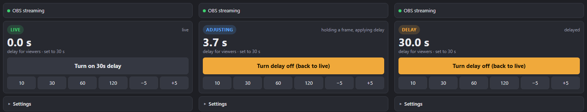
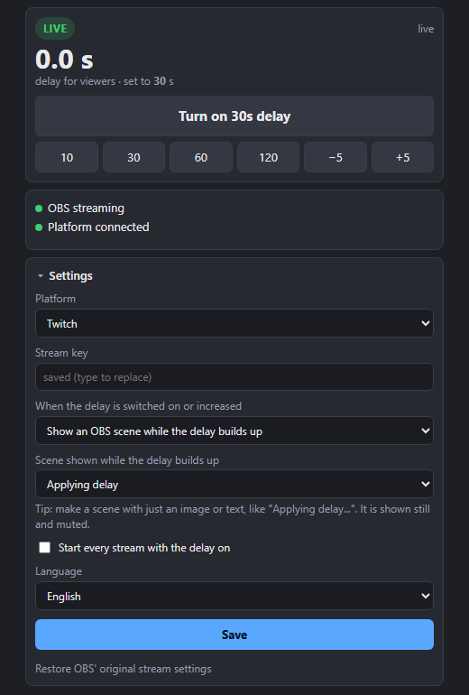

# Dynamic Delay for OBS

**English** · [Português](README.pt-BR.md) · Developed by [ragnarcb](https://github.com/ragnarcb)

Turn your stream delay on and off **at any moment, while you are live**, from a panel inside OBS or with a hotkey.



OBS' built-in "Stream Delay" can only be changed while the stream is stopped. With Dynamic Delay you go live as usual and, whenever you need it (spoilers, personal info on screen, a competitive match), you press a button and the stream becomes 30 s delayed. Press it again and it is back to live, without the stream dropping.

## Contents

- [Features](#features)
- [Installation (step by step)](#installation-step-by-step)
- [Using it while live](#using-it-while-live)
- [What viewers see](#what-viewers-see)
- [Troubleshooting](#troubleshooting)
- [Updating and uninstalling](#updating-and-uninstalling)
- [How it works](#how-it-works)
- [API and integrations](#api-and-integrations)
- [Development](#development)
- [Known limitations](#known-limitations)
- [License](#license)

## Features

- **Delay you can switch while live:** on, off, presets (10, 30, 60, 120 s) and ±5 s steps, without restarting the stream.
- **Three ways to apply the delay:** rewind (no freeze), show one of your OBS scenes, or freeze the picture.
- **Panel inside OBS:** a dock with the stream state, the real delay viewers get and all the settings.
- **Hotkeys** in OBS' own hotkey settings.
- **Two-click install:** the installer configures OBS for you and backs up everything it changes.
- **Twitch, YouTube, Kick** and any RTMP/RTMPS destination.
- **English and Portuguese:** panel, installer, script and messages in both languages.
- **Lightweight:** nothing is re-encoded. The relay only buffers and forwards the video OBS already encoded, with negligible CPU use.
- **Resilient:** reconnects on its own if the platform connection drops, and finishes sending the delayed tail when you end the stream.

## Installation (step by step)

> Requirements: Windows 10/11 and OBS Studio 28 or newer, opened at least once.

**1. Download the installer.** From the [Releases](../../releases/latest) page, download `Dynamic-Delay-Installer.exe` (English). `Instalar-Delay-Dinamico.exe` is the Portuguese version; the language can be changed later in the panel.

**2. Double-click it.** A console window opens and explains what it will do. Press Enter to install.

**3. Close OBS if it is open.** The installer waits for it: OBS rewrites its settings when it closes, so they must be changed while it is closed.

**4. Enter your platform and stream key.** If OBS was already set up for Twitch or YouTube, the installer imports the destination and key by itself. Otherwise it asks:

```
Where do you stream to?
  1 = Twitch   2 = YouTube   3 = Kick / other (paste URL)
Option (Enter = Twitch):
Stream key (Enter = fill in later in the panel):
```

**5. Done.** The installer:

- copies the relay and the script to `%APPDATA%\obs-dynamic-delay`;
- makes OBS stream through the local relay (`rtmp://127.0.0.1:1935/live`);
- turns off OBS' built-in Stream Delay;
- adds the script and the **Dynamic Delay** panel to OBS;
- backs up every file it changes (`*.dd-backup` and `obs-service-backup.json`).

At the end it offers to open OBS.

**6. Place the panel.** In OBS, the panel is under **Docks > Dynamic Delay**. Drag it wherever you like, for example next to "Controls".

**7. (Optional) Set hotkeys.** In **Settings > Hotkeys**, look for "Dynamic Delay":

| Hotkey | What it does |
|---|---|
| Dynamic Delay: toggle on/off | switches between live and delayed |
| Dynamic Delay: turn on | turns the delay on |
| Dynamic Delay: turn off (back to live) | goes back to live |
| Dynamic Delay: increase / decrease | adds or removes 5 s (the step is set in the script options) |

**8. Do a test stream.** Use an unlisted or test stream before using it on an important one.

## Using it while live

Start streaming as usual with the OBS button. The panel shows:

| Indicator | Meaning |
|---|---|
| **LIVE** (green) | viewers see the stream in real time |
| **ADJUSTING** (blue) | the delay is being applied or removed |
| **DELAY** (orange) | the stream is delayed; the big number is the real delay |
| OBS streaming / OBS ready | OBS is connected to the relay |
| Platform connected | the relay is sending to Twitch/YouTube/... |

In the panel's **Settings** section you change platform, URL, key, [what viewers see when the delay turns on](#what-viewers-see), "Start every stream with the delay on" and the **language** (hotkey names switch language the next time OBS opens). Destination or key changes made during a stream apply from the next stream on; the delay length changes right away.

## What viewers see

For the stream to be 30 s behind, viewers have to "lose" 30 s at some point. You choose how, in the panel, under **Settings > When the delay is switched on or increased**:



| Mode | What viewers see when the delay turns on |
|---|---|
| **Rewind** (default) | The stream jumps back 30 s **instantly** and keeps playing, with no freeze and no audio gap. Viewers see the last 30 s again. |
| **Show an OBS scene** | OBS briefly switches to the chosen scene (for example an "Applying delay..." image), and that picture stays on screen, still and muted, while the delay builds up. Then OBS switches back to your scene by itself. |
| **Freeze the picture** | The live picture freezes on the next keyframe, with muted audio, while the delay builds up. |

Otherwise the three modes behave the same:

| Action | What viewers see |
|---|---|
| **Turn the delay off** | A hard cut to the present: the buffered part is dropped and the stream is live again (within about 2 s). |
| **Increase / decrease** | Increasing applies the chosen mode for the difference only; decreasing cuts by the difference. |
| **End the stream with the delay on** | The relay finishes sending the delayed tail and only then ends the stream on the platform. To end right away, turn the delay off after stopping. |

Details of each mode:

- **Rewind:** the relay always keeps the last seconds it sent (about 23 MB for 30 s at 6 Mbps). If the stream started less than the delay ago, it rewinds what it has and freezes for the rest. The jump happens at a keyframe, so it may go back up to about 1 s more than asked.
- **Show a scene:** the scene is visible live for up to 2 s (until the next keyframe) before it holds still. Videos and animations in the scene do not play. If the scene does not exist or the OBS script does not answer, the relay freezes the live picture instead.

Real output tests (the numbers are seconds of the source video):

**Rewind:** at second 6 the stream jumps back to 0 and keeps playing delayed, then cuts to 24 when the delay is turned off.


**Freeze:** holds on 6 while the delay builds up, plays delayed, then cuts to 24.


## Troubleshooting

| Symptom | What to do |
|---|---|
| The panel shows **RELAY CLOSED** | Normal while OBS is starting. If it stays, open **Tools > Scripts**, check that `obs-dynamic-delay.lua` is listed and click "Restart relay". |
| **Platform reconnecting** with an error | Almost always a wrong key or URL. Check the panel's Settings section. |
| **OBS not configured** | Click **Configure OBS automatically** in the panel. |
| OBS says it could not connect to the server | The relay did not start. See the log at `%APPDATA%\obs-dynamic-delay\obs-dynamic-delay.log`. |
| The panel does not show up | **Docks > Dynamic Delay** menu. If it is not there, run the installer again with OBS closed. |
| I want to stream without the relay again | In the panel: Settings > "Restore OBS' original stream settings" (click twice to confirm). |

When opening an issue, attach `obs-dynamic-delay.log`. The stream key is not written to it.

## Updating and uninstalling

Double-click the installer again. It detects the existing install and offers:

- **1:** update/reinstall, keeping your settings;
- **2:** uninstall, removing the script and the panel and restoring the original stream settings.

The command line works too: `Dynamic-Delay-Installer.exe --install` or `--uninstall`. Installing with the other language's installer switches the app language.

## How it works

```
                    ┌──────────────── obs-dynamic-delay (relay) ────────────────┐
OBS ──RTMP──▶ 127.0.0.1:1935 ──▶ buffer + delay engine ──▶ RTMP/RTMPS client ──▶ Twitch / YouTube / Kick
 ▲                                   ▲            ▲
 │ Lua script (hotkeys, bridge)  UDP 8788     HTTP 8787 (API)
 └───────────────────────────────────┘            ▲
                                       OBS dock panel · Stream Deck
```

- **Relay (Rust, `src/`):** receives RTMP from OBS, keeps the already encoded packets and forwards them with the current delay.
  - **When the delay grows:** in rewind mode it puts recently sent packets back in the queue and sends them again; in scene and freeze modes it repeats a keyframe (plus muted AAC audio) until the buffer is full. In scene mode the repeated frame is the first one encoded after the script switched scenes in OBS.
  - **When it shrinks:** it cuts at the most recent possible keyframe.
  - Timestamps are rewritten so the platform gets a continuous timeline, B-frames included (PTS and DTS).
- **OBS script (Lua, `obs/`):** registers the hotkeys, starts and closes the relay with OBS and applies inside OBS what the panel asks for (stream settings and the delay scene). It uses the LuaJIT bundled with OBS, so no Python install is needed.
- **Panel (`src/panel.html`):** page served by the relay and installed as an OBS dock.
- **Installer (`src/installer.rs`):** the same exe; double-clicked, it configures OBS.

**Why Rust:** the heavy lifting is an RTMP server and client that hold minutes of video in memory and resend everything at the right time for hours. Rust delivers that as a single dependency-free `.exe`, with no garbage-collector pauses and near-zero CPU. A Python script inside OBS has no access to the encoded video, and every streamer would need a compatible interpreter installed.

**Memory:** roughly bitrate times delay (6 Mbps × 30 s ≈ 23 MB).

## API and integrations

The HTTP API at `http://127.0.0.1:8787` accepts GET and POST, so it works directly with Stream Deck ("Website" action), Touch Portal, chat bots, etc.

| Route | Action |
|---|---|
| `/api/toggle` | toggles the delay |
| `/api/on` · `/api/off` | turns it on · off |
| `/api/delay/{s}` | sets the delay in seconds |
| `/api/add/{s}` | adds (negative works: `/api/add/-5`) |
| `/api/status` | state as JSON |
| `/api/config` | reads (GET) or writes (POST JSON) destination, key and options |
| `/api/obs/configure` · `/api/obs/restore` | asks the OBS script to configure or restore the stream settings |

UDP port `8788` takes text commands: `toggle`, `on`, `off`, `set 30`, `add -5` and `status`, plus the ones used by the script (`poll`, `import`, `result`, `quit`, `stay`, `scenes`, `scene_shown`, `scene_failed`).

Settings live in `%APPDATA%\obs-dynamic-delay\config.toml`, normally edited from the panel.

## Development

Requires stable [Rust](https://rustup.rs). The end-to-end test also needs `ffmpeg` and `curl` on the PATH.

```sh
cargo build --release        # target/release/obs-dynamic-delay.exe (English)
cargo build --release --features pt   # same, Portuguese by default
cargo test                   # delay engine, FLV parser, config, INI, commands, texts
bash scripts/e2e-test.sh     # ffmpeg plays OBS and the platform; toggles the delay mid-stream
```

Run only the relay, without installing: `obs-dynamic-delay.exe path\config.toml` (the file is created with comments if missing). Handy variables to test the installer without touching your real OBS: `DD_OBS_CONFIG_DIR`, `DD_INSTALL_DIR` and `DD_SKIP_OBS_CHECK=1`.

| File | Contents |
|---|---|
| `src/engine.rs` | delay engine: buffer, rewind, freeze, cuts, timestamps |
| `src/flv.rs` | FLV packet inspection (AVC/HEVC/AV1, AAC), muted AAC |
| `src/ingest.rs` | RTMP server receiving from OBS |
| `src/upstream.rs` | RTMP/RTMPS client to the platform, with reconnection |
| `src/control.rs` | HTTP API and UDP commands |
| `src/installer.rs` | installer and uninstaller |
| `src/i18n.rs` | English and Portuguese texts (`t!` macro) |
| `src/panel.html` | panel (texts in its `TEXT` dictionary) |
| `obs/obs-dynamic-delay.lua` | OBS script (texts through `L()`) |

**Releasing:** bump `version` in `Cargo.toml`, update `CHANGELOG.md`, build both installers and create the release:

```sh
cargo build --release && cp target/release/obs-dynamic-delay.exe Dynamic-Delay-Installer.exe
cargo build --release --features pt && cp target/release/obs-dynamic-delay.exe Instalar-Delay-Dinamico.exe
gh release create vX.Y.Z Dynamic-Delay-Installer.exe Instalar-Delay-Dinamico.exe --notes-file notes.md
```

## Known limitations

- RTMP/RTMPS only. WHIP, SRT and Twitch's "Enhanced Broadcasting" (multitrack) do not go through the relay.
- The delay changes at keyframes: turning it off (or growing in scene/freeze mode) waits for or cuts at a keyframe (up to 2 s with OBS' default interval).
- In scene and freeze modes the still picture repeats a keyframe at 2 fps to save bandwidth (`filler_fps` in `config.toml`).
- The installer is for Windows. The relay and the script run on Linux and macOS, but installing there is manual.

## License

Dynamic Delay is **fully open source** under the [MIT License](LICENSE). You can use, copy, modify, share and even sell it, in personal or commercial projects, as long as you **give proper credit**: keep the copyright notice (`Copyright (c) 2026 ragnarcb`) and the license text in copies and derived works, and mention [ragnarcb](https://github.com/ragnarcb) as the original author.

Contributions are welcome: open an issue or a pull request.

---

Developed by [ragnarcb](https://github.com/ragnarcb).
