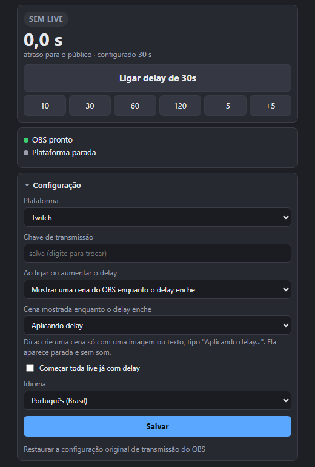

# Delay Dinâmico para OBS

[English](README.md) · **Português** · Desenvolvido por [ragnarcb](https://github.com/ragnarcb)

Ligue e desligue o delay da sua live **a qualquer momento, com a transmissão no ar**, direto de um painel dentro do OBS ou por atalho de teclado.


O "Stream Delay" que já vem no OBS só pode ser mudado com a live parada. Com o Delay Dinâmico você entra ao vivo normalmente e, quando precisar (spoiler, informação pessoal na tela, partida competitiva), aperta um botão e a live passa a ter 30 s de atraso. Aperta de novo e ela volta para o ao vivo, sem cair.

## Sumário

- [Funcionalidades](#funcionalidades)
- [Instalação (passo a passo)](#instalação-passo-a-passo)
- [Usando durante a live](#usando-durante-a-live)
- [O que o público vê](#o-que-o-público-vê)
- [Solução de problemas](#solução-de-problemas)
- [Atualizar e desinstalar](#atualizar-e-desinstalar)
- [Como funciona](#como-funciona)
- [API e integrações](#api-e-integrações)
- [Desenvolvimento](#desenvolvimento)
- [Limitações conhecidas](#limitações-conhecidas)
- [Licença](#licença)

## Funcionalidades

- **Delay ligável em tempo real:** ligar, desligar, presets (10, 30, 60, 120 s) e ajuste fino de ±5 s, sem reiniciar a live.
- **Três jeitos de aplicar o delay:** rebobinar (sem congelar), mostrar uma cena sua do OBS, ou congelar a imagem.
- **Painel dentro do OBS:** um dock com o estado da live, o atraso real para o público e toda a configuração.
- **Atalhos de teclado** nas configurações de atalhos do próprio OBS.
- **Instalação com dois cliques:** o instalador configura o OBS sozinho e guarda backup de tudo o que alterar.
- **Twitch, YouTube, Kick** e qualquer destino RTMP/RTMPS.
- **Português e inglês:** painel, instalador, script e mensagens nos dois idiomas.
- **Leve:** nada é re-encodado. O relay só guarda e reenvia o vídeo que o OBS já codificou, com uso de CPU desprezível.
- **Resistente:** reconecta sozinho se a conexão com a plataforma cair, e termina de enviar o trecho atrasado quando você encerra a live.

## Instalação (passo a passo)

> Requisitos: Windows 10/11 e OBS Studio 28 ou mais novo, aberto pelo menos uma vez.

**1. Baixe o instalador.** Na página de [Releases](../../releases/latest), baixe `Instalar-Delay-Dinamico.exe` (em português). O `Dynamic-Delay-Installer.exe` é a versão em inglês; o idioma pode ser trocado depois no painel.

**2. Dê dois cliques nele.** Uma janela de console abre e explica o que vai ser feito. Aperte Enter para instalar.

**3. Feche o OBS, se estiver aberto.** O instalador espera sozinho: o OBS regrava as configurações ao fechar, então elas precisam ser alteradas com ele fechado.

**4. Informe plataforma e chave.** Se o OBS já estava configurado para a Twitch ou o YouTube, o instalador importa o destino e a chave sozinho. Se não achar, ele pergunta:

```
Para onde voce transmite?
  1 = Twitch   2 = YouTube   3 = Kick / outra (colar URL)
Opcao (Enter = Twitch):
Chave de transmissao (Enter = preencher depois no painel):
```

**5. Pronto.** O instalador:

- copia o relay e o script para `%APPDATA%\obs-dynamic-delay`;
- faz o OBS transmitir pelo relay local (`rtmp://127.0.0.1:1935/live`);
- desliga o Stream Delay nativo do OBS;
- adiciona o script e o painel **Delay dinâmico** ao OBS;
- guarda backup de cada arquivo alterado (`*.dd-backup` e `obs-service-backup.json`).

No final ele oferece abrir o OBS.

**6. Posicione o painel.** No OBS, o painel fica em **Docks > Delay dinâmico**. Arraste para onde preferir, por exemplo ao lado de "Controles".

**7. (Opcional) Defina os atalhos.** Em **Configurações > Atalhos**, procure "Delay dinâmico":

| Atalho | O que faz |
|---|---|
| Delay dinâmico: ligar/desligar | alterna entre ao vivo e com delay |
| Delay dinâmico: ligar | liga o delay |
| Delay dinâmico: desligar (voltar ao vivo) | volta para o ao vivo |
| Delay dinâmico: aumentar / diminuir | soma ou tira 5 s (o passo muda nas opções do script) |

**8. Faça uma live de teste.** Use uma live não listada ou de teste antes de usar numa live importante.

## Usando durante a live

Inicie a transmissão normalmente pelo botão do OBS. O painel mostra:

| Indicador | Significado |
|---|---|
| **AO VIVO** (verde) | o público vê a live em tempo real |
| **AJUSTANDO** (azul) | o delay está sendo aplicado ou removido |
| **DELAY** (laranja) | a live está atrasada; o número grande é o atraso real |
| OBS transmitindo / OBS pronto | o OBS está conectado ao relay |
| Plataforma conectada | o relay está enviando para a Twitch/YouTube/... |

Na seção **Configuração** do painel você troca plataforma, URL, chave, [o que aparece ao ligar o delay](#o-que-o-público-vê), a opção "Começar toda live já com delay" e o **idioma** (os nomes dos atalhos mudam de idioma na próxima vez que o OBS abrir). Trocas de destino ou chave feitas durante a live valem a partir da próxima live. Já o tempo do delay muda na hora.

## O que o público vê

Para a live ficar 30 s atrasada, o público precisa "perder" 30 s em algum momento. Você escolhe como, no painel, em **Configuração > Ao ligar ou aumentar o delay**:



| Modo | O que o público vê ao ligar o delay |
|---|---|
| **Rebobinar** (padrão) | A live volta 30 s no tempo **na hora** e segue normalmente, sem congelar e sem cortar o som. O público revê os últimos 30 s. |
| **Mostrar uma cena do OBS** | O OBS troca por um instante para a cena escolhida (por exemplo, uma imagem "Aplicando delay..."), e essa imagem fica na tela, parada e sem som, enquanto o delay enche. Depois volta para a sua cena sozinho. |
| **Congelar a imagem** | A imagem da live congela no próximo quadro-chave, com o áudio mudo, enquanto o delay enche. |

Nos outros casos, os três modos se comportam igual:

| Ação | Efeito para quem assiste |
|---|---|
| **Desligar o delay** | Corte seco para o presente: o trecho guardado é descartado e a live volta a ficar ao vivo (com precisão de cerca de 2 s). |
| **Aumentar / diminuir** | Aumentar aplica o modo escolhido só pela diferença; diminuir corta pela diferença. |
| **Encerrar a live com delay ligado** | O relay termina de enviar o trecho atrasado e só então encerra a live na plataforma. Para encerrar na hora, desligue o delay depois de parar. |

Detalhes de cada modo:

- **Rebobinar:** o relay guarda sempre os últimos segundos já enviados (uns 23 MB para 30 s a 6 Mbps). Se a live começou há menos tempo que o delay, ele volta o que tiver e congela só o restante. O salto acontece num quadro-chave, então pode voltar até cerca de 1 s a mais que o pedido.
- **Mostrar cena:** a cena aparece ao vivo por até 2 s (até o próximo quadro-chave) antes de ficar parada. Vídeos e animações da cena não andam. Se a cena não existir ou o script do OBS não responder, o relay congela a imagem da live.

Testes reais da saída (os números são os segundos do vídeo original):

**Rebobinar:** no segundo 6 a live volta para o 0 e segue atrasada, depois corta para o 24 quando o delay é desligado.


**Congelar:** fica parada no 6 enquanto o delay enche, segue atrasada e corta para o 24.


## Solução de problemas

| Sintoma | O que fazer |
|---|---|
| O painel mostra **RELAY FECHADO** | Normal enquanto o OBS está abrindo. Se continuar, abra **Ferramentas > Scripts** e confira se `obs-dynamic-delay.lua` está na lista; clique em "Reiniciar relay". |
| **Plataforma reconectando** com erro | Quase sempre é chave ou URL errada. Confira na seção Configuração do painel. |
| **OBS não configurado** | Clique em **Configurar o OBS automaticamente** no painel. |
| O OBS diz que não conseguiu conectar ao servidor | O relay não abriu. Veja o log em `%APPDATA%\obs-dynamic-delay\obs-dynamic-delay.log`. |
| O painel não aparece | Menu **Docks > Delay dinâmico**. Se não estiver lá, rode o instalador de novo com o OBS fechado. |
| Quero voltar a transmitir sem o relay | No painel: Configuração > "Restaurar a configuração original de transmissão do OBS" (clique duas vezes para confirmar). |

Ao abrir uma issue, anexe o `obs-dynamic-delay.log`. A chave de transmissão não aparece nele.

## Atualizar e desinstalar

Dê dois cliques no instalador de novo. Ele detecta que já está instalado e oferece:

- **1:** atualizar/reinstalar, mantendo sua configuração;
- **2:** desinstalar, removendo o script e o painel e restaurando a configuração de transmissão original.

Pela linha de comando também funciona: `Instalar-Delay-Dinamico.exe --install` ou `--uninstall`. Instalar com o instalador de outro idioma troca o idioma do app.

## Como funciona

```
                    ┌──────────────── obs-dynamic-delay (relay) ────────────────┐
OBS ──RTMP──▶ 127.0.0.1:1935 ──▶ buffer + motor de delay ──▶ cliente RTMP/RTMPS ──▶ Twitch / YouTube / Kick
 ▲                                   ▲            ▲
 │ script Lua (atalhos, ponte)  UDP 8788     HTTP 8787 (API)
 └───────────────────────────────────┘            ▲
                                       painel dock no OBS · Stream Deck
```

- **Relay (Rust, `src/`):** recebe o RTMP do OBS, guarda os pacotes já codificados e os reenvia com o atraso atual.
  - **Ao aumentar o delay:** no modo rebobinar, devolve à fila os pacotes recentes já enviados e os envia de novo; nos modos cena e congelar, repete um quadro-chave (mais áudio AAC mudo) até o buffer encher. No modo cena, o quadro repetido é o primeiro gerado depois de o script trocar a cena no OBS.
  - **Ao diminuir:** corta no quadro-chave mais recente possível.
  - Os timestamps são reescritos para a plataforma receber uma linha do tempo contínua, inclusive com B-frames (PTS e DTS).
- **Script do OBS (Lua, `obs/`):** registra os atalhos, abre e fecha o relay junto com o OBS e aplica dentro do OBS o que o painel pede (trocar a configuração de transmissão e a cena de delay). Usa o LuaJIT embutido no OBS, então não precisa instalar Python.
- **Painel (`src/panel.html`):** página servida pelo relay e instalada como dock no OBS.
- **Instalador (`src/installer.rs`):** o mesmo exe; aberto com dois cliques, configura o OBS.

**Por que Rust:** o trabalho pesado é um servidor e um cliente RTMP que seguram minutos de vídeo em memória e reenviam tudo no tempo certo por horas. Rust entrega isso num único `.exe` sem dependências, sem pausas de coletor de lixo e com CPU quase zero. Um script Python dentro do OBS não tem acesso ao vídeo codificado, e exigiria que cada streamer configurasse um interpretador compatível.

**Memória:** mais ou menos o bitrate vezes o delay (6 Mbps × 30 s ≈ 23 MB).

## API e integrações

A API HTTP em `http://127.0.0.1:8787` aceita GET e POST, então funciona direto no Stream Deck (ação "Website"), Touch Portal, bots de chat etc.

| Rota | Ação |
|---|---|
| `/api/toggle` | liga/desliga |
| `/api/on` · `/api/off` | liga · desliga |
| `/api/delay/{s}` | define o delay em segundos |
| `/api/add/{s}` | soma (aceita negativo: `/api/add/-5`) |
| `/api/status` | estado em JSON |
| `/api/config` | lê (GET) ou grava (POST JSON) destino, chave e opções |
| `/api/obs/configure` · `/api/obs/restore` | pede ao script do OBS para configurar ou restaurar a transmissão |

A porta UDP `8788` aceita comandos em texto: `toggle`, `on`, `off`, `set 30`, `add -5` e `status`, além dos comandos usados pelo script (`poll`, `import`, `result`, `quit`, `stay`).

A configuração fica em `%APPDATA%\obs-dynamic-delay\config.toml`, normalmente editada pelo painel.

## Desenvolvimento

Requer [Rust](https://rustup.rs) estável. Para o teste de ponta a ponta, também `ffmpeg` e `curl` no PATH.

```sh
cargo build --release        # target/release/obs-dynamic-delay.exe
cargo test                   # motor de delay, parser FLV, config, INI, comandos
bash scripts/e2e-test.sh     # ffmpeg faz o papel do OBS e da plataforma; liga/desliga o delay no meio
```

Rodar só o relay, sem instalar: `obs-dynamic-delay.exe caminho\config.toml` (o arquivo é criado com comentários se não existir). Variáveis úteis para testar o instalador sem tocar no OBS real: `DD_OBS_CONFIG_DIR`, `DD_INSTALL_DIR` e `DD_SKIP_OBS_CHECK=1`.

| Arquivo | Conteúdo |
|---|---|
| `src/engine.rs` | motor de delay: buffer, congelamento, corte, timestamps |
| `src/flv.rs` | inspeção de pacotes FLV (AVC/HEVC/AV1, AAC), AAC mudo |
| `src/ingest.rs` | servidor RTMP que recebe do OBS |
| `src/upstream.rs` | cliente RTMP/RTMPS para a plataforma, com reconexão |
| `src/control.rs` | API HTTP e comandos UDP |
| `src/installer.rs` | instalador e desinstalador |
| `src/i18n.rs` | textos em inglês e português |
| `src/panel.html` | painel |
| `obs/obs-dynamic-delay.lua` | script do OBS |

O idioma padrão vem do build: `cargo build --release` gera a versão em inglês, e `cargo build --release --features pt` gera a versão em português. Os textos ficam em `src/i18n.rs` (macro `t!`), no dicionário `TEXT` de `src/panel.html` e na função `L()` do script Lua.

**Publicar uma versão:** atualize `version` no `Cargo.toml` e o `CHANGELOG.md`, gere os dois instaladores e crie a release:

```sh
cargo build --release && cp target/release/obs-dynamic-delay.exe Dynamic-Delay-Installer.exe
cargo build --release --features pt && cp target/release/obs-dynamic-delay.exe Instalar-Delay-Dinamico.exe
gh release create vX.Y.Z Dynamic-Delay-Installer.exe Instalar-Delay-Dinamico.exe --notes-file notes.md
```

## Limitações conhecidas

- Só RTMP/RTMPS. WHIP, SRT e a "Transmissão aprimorada" (multitrack) da Twitch não passam pelo relay.
- Ligar o delay espera o próximo quadro-chave (até 2 s com o intervalo padrão do OBS), e desligar corta num quadro-chave.
- Nos modos cena e congelar, a imagem parada repete um quadro-chave a 2 fps, para gastar pouca banda (`filler_fps` no `config.toml`).
- O instalador é para Windows. O relay e o script funcionam em Linux e macOS, mas lá a instalação é manual.

## Licença

O Delay Dinâmico é **totalmente open source**, sob a [licença MIT](LICENSE). Você pode usar, copiar, modificar, compartilhar e até vender, em projetos pessoais ou comerciais, desde que **dê os devidos créditos**: mantenha o aviso de copyright (`Copyright (c) 2026 ragnarcb`) e o texto da licença nas cópias e nos trabalhos derivados, e cite [ragnarcb](https://github.com/ragnarcb) como autor original.

Contribuições são bem-vindas: abra uma issue ou um pull request.

---

Desenvolvido por [ragnarcb](https://github.com/ragnarcb).
