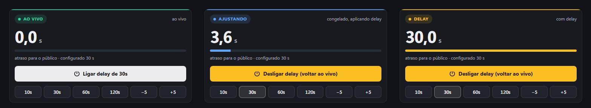
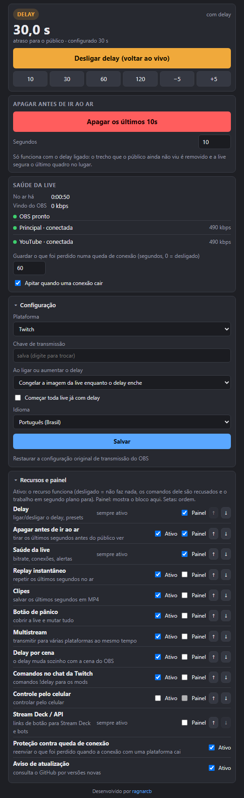
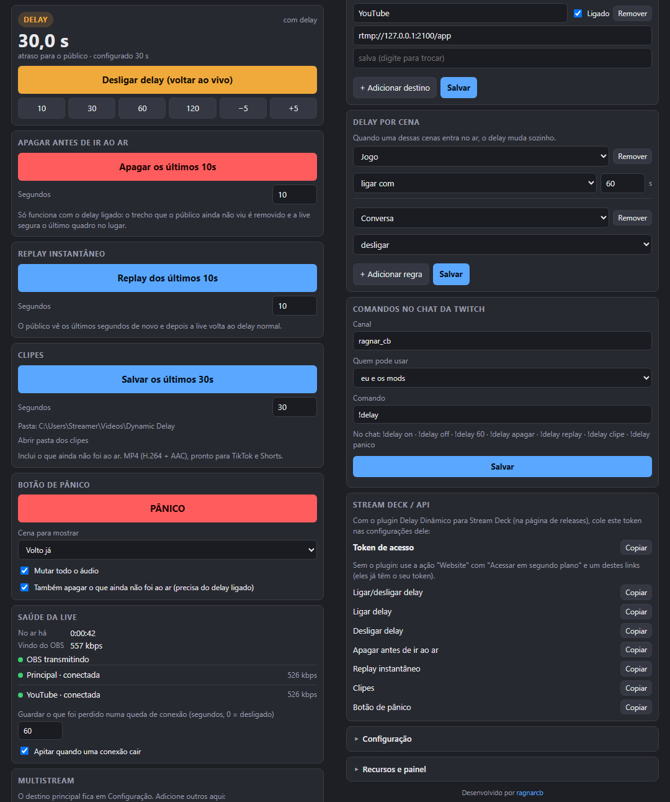

# Delay Dinâmico para OBS

[English](README.md) · **Português** · Desenvolvido por [ragnarcb](https://github.com/ragnarcb)

Ligue e desligue o delay da sua live **a qualquer momento, com a transmissão no ar**, e tenha um kit completo em volta dele: apagar o que não pode ir ao ar, replay instantâneo, clipes, multistream, proteção contra queda de conexão e mais. Tudo fica num painel dentro do OBS que você monta do seu jeito.



O "Stream Delay" que já vem no OBS só pode ser mudado com a live parada. Com o Delay Dinâmico você entra ao vivo normalmente e, quando precisar (spoiler, informação pessoal na tela, partida competitiva), aperta um botão e a live passa a ter 30 s de atraso. Aperta de novo e ela volta para o ao vivo, sem cair.

## Sumário

- [Funcionalidades](#funcionalidades)
- [Instalação](#instalação)
- [O painel](#o-painel)
- [O que o público vê](#o-que-o-público-vê)
- [Recursos em detalhe](#recursos-em-detalhe)
- [Atalhos](#atalhos)
- [Stream Deck](#stream-deck)
- [Solução de problemas](#solução-de-problemas)
- [Atualizar e desinstalar](#atualizar-e-desinstalar)
- [Segurança](#segurança)
- [Como funciona](#como-funciona)
- [API](#api)
- [Desenvolvimento](#desenvolvimento)
- [Limitações conhecidas](#limitações-conhecidas)
- [Licença](#licença)

## Funcionalidades

**Delay**
- Liga e desliga o delay com a live no ar, com presets (10, 30, 60, 120 s) e ajuste de ±5 s.
- Três jeitos de aplicar: **rebobinar** (sem congelar), mostrar uma **cena do OBS** sua, ou **congelar** a imagem.
- **Delay por cena:** o delay muda sozinho quando uma cena entra no ar (por exemplo, liga na "Ranqueada" e desliga na "Conversa").

**Proteção**
- **Apagar antes de ir ao ar:** vazou endereço, senha ou uma notificação? Um toque tira os últimos segundos antes de o público ver.
- **Botão de pânico:** cobre a live com uma cena, muta todo o áudio e apaga o que ainda não foi ao ar, num toque só.

**Conteúdo e alcance**
- **Replay instantâneo** dos últimos segundos no ar, como replay de jogada.
- **Clipes:** salva os últimos segundos em MP4, pronto para TikTok e Shorts.
- **Multistream:** Twitch, YouTube, Kick e qualquer destino RTMP/RTMPS ao mesmo tempo, com uma saída só do OBS.
- **Proteção contra queda de conexão:** se a conexão com uma plataforma cair, o que não foi enviado fica guardado e é enviado quando ela voltar, e o público não perde nada.

**Controle**
- Um **painel dentro do OBS** feito de blocos: mostre só o que você usa, na ordem que quiser.
- **Todo recurso pode ser desligado de verdade**, não só escondido: um recurso desligado não faz nada.
- **Atalhos** do OBS, **plugin do Stream Deck**, **comandos no chat da Twitch** para você e seus mods, e **controle pelo celular** com QR code.
- **Saúde da live:** bitrate vindo do OBS, estado de cada destino e um apito quando uma conexão cai.
- **Português e inglês** em tudo.

**Leve:** nada é re-encodado. O relay só guarda e reenvia o vídeo que o OBS já codificou, com uso de CPU desprezível.

## Instalação

> Requisitos: Windows 10/11 e OBS Studio 28 ou mais novo, aberto pelo menos uma vez.

1. Na página de [Releases](../../releases/latest), baixe o **`Instalar-Delay-Dinamico.exe`** (português). O `Dynamic-Delay-Installer.exe` é a versão em inglês; o idioma pode ser trocado depois no painel.
2. Dê dois cliques nele. O Windows pode mostrar "O Windows protegeu o computador", porque o exe não tem assinatura digital: clique em **Mais informações > Executar assim mesmo**.
3. Clique em **Sim** para instalar. Se o OBS estiver aberto, o instalador pede para fechar (o OBS regrava as configurações ao fechar).
4. No final, o instalador mostra tudo o que fez e oferece abrir o OBS.

O instalador:
- copia o relay e o script do OBS para `%APPDATA%\obs-dynamic-delay`;
- importa o destino e a chave que já estavam no OBS, quando existem;
- faz o OBS transmitir pelo relay local (`rtmp://127.0.0.1:1935/live`) e desliga o Stream Delay nativo do OBS;
- adiciona o script e o painel **Delay dinâmico** ao OBS;
- guarda backup de cada arquivo que altera (`*.dd-backup` e `obs-service-backup.json`).

No OBS, o painel fica em **Docks > Delay dinâmico**: arraste para onde quiser, por exemplo ao lado de "Controles". Se faltar a chave de transmissão, o painel pede em **Configuração**.

Faça antes uma live de teste ou não listada. O passo a passo está em [docs/TESTING.md](docs/TESTING.md).

## O painel

Cada recurso é um bloco. Em **Recursos e painel** cada um tem dois controles:

- **Ativo:** o recurso funciona. Desligado, ele não faz nada: os comandos dele são recusados (painel, atalhos, chat, Stream Deck), o trabalho em segundo plano para e o bloco some. Por exemplo, com o chat desligado o relay nem conecta na Twitch; com o controle pelo celular desligado o painel não fica aberto na rede; com replay e clipes desligados não se usa memória extra.
- **Painel:** mostra ou esconde o bloco, e as setas definem a ordem. Um recurso ativo mas escondido continua funcionando pelos atalhos, pelo chat e pelo Stream Deck.

Quem só quer o delay desliga todo o resto. O **Delay** é o núcleo e fica sempre ativo. Comandos no chat e controle pelo celular começam desligados.



Por padrão o painel mostra **Delay**, **Apagar antes de ir ao ar** e **Saúde da live**. Com todos os blocos ligados:



| Bloco | Para que serve |
|---|---|
| Delay | estado (AO VIVO, AJUSTANDO, DELAY, REPLAY, PÂNICO), atraso real para o público, liga/desliga, presets |
| Apagar antes de ir ao ar | tira os últimos segundos antes de o público ver |
| Replay instantâneo | repete os últimos segundos no ar |
| Clipes | salva os últimos segundos em MP4 e abre a pasta dos clipes |
| Botão de pânico | cena de cobertura, mudo e apagar num toque |
| Saúde da live | tempo no ar, bitrate do OBS, estado e bitrate de cada destino, alcançar depois de uma queda, apito de alerta |
| Multistream | destinos extras com nome, URL, chave e liga/desliga |
| Delay por cena | regras: cena X no ar liga, desliga, ou liga com N segundos |
| Comandos no chat da Twitch | canal, quem pode usar, nome do comando |
| Controle pelo celular | QR code para abrir o painel no celular (mesmo Wi-Fi) |
| Proteção contra queda de conexão (sem bloco) | liga/desliga em Recursos e painel; os segundos guardados ficam em Saúde da live |
| Aviso de atualização (sem bloco) | liga/desliga em Recursos e painel |
| Stream Deck / API | token de acesso para o plugin e links prontos |
| Configuração (sempre aparece) | plataforma, URL, chave, o que o público vê ao ligar o delay, começar toda live com delay, idioma |

## O que o público vê

Para a live ficar 30 s atrasada, o público precisa "perder" 30 s em algum momento. Você escolhe como, em **Configuração > Ao ligar ou aumentar o delay**:

| Modo | O que o público vê ao ligar o delay |
|---|---|
| **Rebobinar** (padrão) | A live volta 30 s no tempo **na hora** e segue normalmente, sem congelar e sem cortar o som. O público revê os últimos 30 s. |
| **Mostrar uma cena do OBS** | O OBS troca por um instante para a cena escolhida (por exemplo, uma imagem "Aplicando delay..."), e essa imagem fica na tela, parada e sem som, enquanto o delay enche. Depois volta para a sua cena sozinho. |
| **Congelar a imagem** | A imagem da live congela no próximo quadro-chave, com o áudio mudo, enquanto o delay enche. |

Em todos os modos:

| Ação | Efeito para quem assiste |
|---|---|
| **Desligar o delay** | Corte seco para o presente: o trecho guardado é descartado e a live volta a ficar ao vivo (com precisão de cerca de 2 s). |
| **Aumentar / diminuir** | Aumentar aplica o modo escolhido só pela diferença; diminuir corta pela diferença. |
| **Encerrar a live com delay ligado** | O relay termina de enviar o trecho atrasado e só então encerra a live na plataforma. Para encerrar na hora, desligue o delay depois de parar. |

- **Rebobinar:** o relay guarda sempre os últimos segundos já enviados (uns 23 MB para 30 s a 6 Mbps). Se a live começou há menos tempo que o delay, ele volta o que tiver e congela só o restante. O salto acontece num quadro-chave, então pode voltar até cerca de 1 s a mais que o pedido.
- **Mostrar cena:** a cena aparece ao vivo por até 2 s (até o próximo quadro-chave) antes de ficar parada. Vídeos e animações da cena não andam. Se a cena não existir ou o script do OBS não responder, o relay congela a imagem da live.

Testes reais da saída (os números são os segundos do vídeo original):

**Rebobinar:** no segundo 6 a live volta para o 0 e segue atrasada, depois corta para o 24 quando o delay é desligado.


**Congelar:** fica parada no 6 enquanto o delay enche, segue atrasada e corta para o 24.


## Recursos em detalhe

### Apagar antes de ir ao ar

Com o delay ligado, o que você fez nos últimos segundos ainda não chegou ao público. Aperte **Apagar** (bloco, atalho, chat `!delay apagar` ou Stream Deck) e os segundos mais recentes (10 por padrão) saem do buffer. O público vê a live segurar o último quadro, sem som, no lugar do trecho, e depois seguir. O delay continua o mesmo. O trecho apagado também não vai para os clipes.

### Replay instantâneo

Repete os últimos segundos (10 por padrão) no ar e depois corta de volta para o delay normal. Funciona com ou sem o delay ligado.

### Clipes

Salva os últimos segundos (30 por padrão, até 120) como `clip_<data>.mp4` em `Vídeos\Dynamic Delay` (ou na pasta da configuração). Inclui o que ainda não foi ao ar, então dá para clipar algo que acabou de acontecer. H.264 + AAC vira MP4; outros codecs (HEVC, AV1) são salvos em FLV.

### Botão de pânico

Um toque: o OBS troca para a cena de pânico (por exemplo, "Volto já"), todo o áudio é mutado e, com o delay ligado, o que ainda não foi ao ar é apagado. Aperte de novo para voltar: a cena anterior volta e só as fontes que o pânico mutou são desmutadas.

### Multistream

Adicione destinos no bloco **Multistream** (nome, URL do servidor, chave). Cada um recebe a mesma live atrasada numa conexão própria, e um problema em um não afeta os outros. A sua internet precisa aguentar o bitrate uma vez para cada destino.

### Proteção contra queda de conexão

Quando a conexão com uma plataforma cai, o relay guarda o que não conseguiu enviar (até 60 s por padrão, ajustável em **Saúde da live**) e envia depois de reconectar, no ritmo normal. Quem assiste naquela plataforma não perde nada; aquele destino fica esse tempo atrás, e o botão **Alcançar** traz de volta. Numa rede lenta demais para o bitrate, o relay pula para a frente em vez de ocupar cada vez mais memória.

### Delay por cena

Regras como "**Ranqueada** no ar: ligar com 60 s" e "**Conversa**: desligar". As cenas que o modo "mostrar cena" e o botão de pânico usam nunca disparam regras.

### Comandos no chat da Twitch

Ative em **Recursos e painel** e escreva o nome do seu canal no bloco **Comandos no chat da Twitch** (só o nome; um link `twitch.tv/...` também funciona). O relay lê o chat de forma anônima (sem login, sem token) e só aceita comandos de você, dos seus mods, ou também dos VIPs:

`!delay on` · `!delay off` · `!delay 60` (liga com 60 s) · `!delay apagar [s]` · `!delay replay [s]` · `!delay clipe [s]` · `!delay panico` (também em inglês: `on`, `off`, `censor`, `clip`, `panic`).

### Controle pelo celular

Ative o **Controle pelo celular** em **Recursos e painel** e aponte a câmera do celular para o QR code (mesmo Wi-Fi). Na primeira vez o Windows pode pedir para liberar a conexão. O link leva o token de acesso: quem tiver ele controla o delay, então não compartilhe.

## Atalhos

Em **Configurações > Atalhos**, procure "Delay dinâmico":

| Atalho | O que faz |
|---|---|
| ligar/desligar | alterna entre ao vivo e com delay |
| ligar / desligar (voltar ao vivo) | define o estado do delay |
| aumentar / diminuir | soma ou tira 5 s (o passo muda nas opções do script) |
| apagar antes de ir ao ar | tira os segundos mais recentes que ainda não foram ao ar |
| replay instantâneo | repete os últimos segundos |
| salvar clipe | salva os últimos segundos em MP4 |
| botão de pânico | liga / desliga o modo pânico |

## Stream Deck

**Plugin (experimental):** baixe o `Dynamic-Delay-StreamDeck.streamDeckPlugin` nas releases e dê dois cliques. Arraste as ações "Dynamic Delay" para os botões; nas configurações de qualquer uma delas, cole o token de acesso do bloco **Stream Deck / API** do painel. O botão de delay mostra LIVE ou DELAY com os segundos atuais, e o de pânico mostra ON enquanto estiver ativo.


O plugin foi testado com um Stream Deck simulado, ainda não num aparelho de verdade: avise se algo não funcionar.

**Sem o plugin:** use a ação "Website" com "Acessar em segundo plano" e um dos links do bloco **Stream Deck / API** (eles já têm o seu token).

## Solução de problemas

| Sintoma | O que fazer |
|---|---|
| O painel mostra **RELAY FECHADO** | Normal enquanto o OBS está abrindo. Se continuar, abra **Ferramentas > Scripts**, confira se `obs-dynamic-delay.lua` está na lista e clique em "Reiniciar relay". |
| O painel diz que falta o token de acesso | Abra pelo OBS (menu Docks) ou pelo botão "Abrir painel" do script, não digitando o endereço. |
| **Plataforma reconectando** com erro | Quase sempre é chave ou URL errada. Confira em **Configuração**. |
| **OBS não configurado** | Clique em **Configurar o OBS automaticamente** no painel. |
| O OBS não consegue conectar ao servidor | O relay não abriu. Veja `%APPDATA%\obs-dynamic-delay\obs-dynamic-delay.log`. |
| O painel não aparece | **Docks > Delay dinâmico**. Se não estiver lá, rode o instalador de novo com o OBS fechado. |
| "O Windows protegeu o computador" | O exe não tem assinatura digital. Clique em **Mais informações > Executar assim mesmo**. |
| Os comandos do chat não fazem nada | Ative **Comandos no chat da Twitch** em **Recursos e painel** e escreva o nome do canal no bloco dele. O log (`obs-dynamic-delay.log`) precisa mostrar `[chat] joined #seucanal`. |
| O celular não abre o painel | Mesmo Wi-Fi, libere a conexão no aviso do firewall do Windows e use o link do QR code. |
| Quero voltar a transmitir sem o relay | **Configuração > Restaurar a configuração original de transmissão do OBS** (clique duas vezes para confirmar). |

Ao abrir uma issue, anexe o `obs-dynamic-delay.log`. As chaves de transmissão não aparecem nele.

## Atualizar e desinstalar

O painel avisa quando sai uma versão nova. Baixe o instalador de novo e dê dois cliques: **Sim** atualiza (sua configuração e suas chaves ficam), **Não** desinstala (tira o script e o painel e restaura a configuração de transmissão original). Pela linha de comando: `Instalar-Delay-Dinamico.exe --install` ou `--uninstall` (`--console` usa o instalador em texto).

## Segurança

- Toda chamada à API precisa do token de acesso criado na primeira vez (`api_token` no `config.toml`). Sites abertos no seu navegador não conseguem controlar o delay nem ler a sua configuração.
- A API nunca devolve chaves de transmissão nem o token.
- Por padrão o painel só escuta no seu PC (`127.0.0.1`). O **controle pelo celular** (desligado por padrão) abre para a sua rede local, ainda protegido pelo token.
- Recursos desligados não fazem nada: sem conexão com o chat, sem porta na rede, sem buffers extras.
- O relay só abre três lugares fixos no seu PC quando pedido (o GitHub do autor, a página de releases e a pasta dos clipes).

## Como funciona

```
                  ┌──────────────────── obs-dynamic-delay (relay) ────────────────────┐
OBS ──RTMP──▶ 127.0.0.1:1935 ──▶ motor de delay ──▶ um cliente RTMP/RTMPS por destino ──▶ Twitch / YouTube / Kick
 ▲                                  │   ▲                      (buffer próprio: quedas, rede lenta)
 │ script Lua (atalhos, cenas,      │   └── HTTP 8787 + token ◀── painel dock · celular · Stream Deck
 │ pânico, config. do OBS) ◀── UDP 8788                ▲
 └────────────────────────────────── clipes (MP4) ◀────┘         chat da Twitch (IRC, só leitura)
```

- **Relay (Rust, `src/`):** recebe o RTMP do OBS, guarda os pacotes já codificados e os reenvia com o atraso atual.
  - Aumentar o delay: rebobinar devolve à fila os pacotes recentes já enviados; cena e congelar repetem um quadro-chave (mais áudio AAC mudo) até o buffer encher.
  - Diminuir corta no quadro-chave mais recente possível; apagar tira os pacotes mais novos que ainda não foram ao ar e segura o último quadro no lugar.
  - Os timestamps são reescritos para cada plataforma receber uma linha do tempo contínua, inclusive com B-frames.
- **Script do OBS (Lua, `obs/`):** atalhos, abre e fecha o relay junto com o OBS, avisa qual cena está no ar e aplica dentro do OBS o que o relay pede (configuração de transmissão, cena de delay, pânico). Usa o LuaJIT embutido no OBS, então não precisa instalar Python.
- **Painel (`src/panel.html`):** o relay grava como `dock.html` com o token, e o OBS carrega como dock.
- **Instalador (`src/installer.rs`):** o mesmo exe; aberto com dois cliques, configura o OBS.

**Por que Rust:** o trabalho pesado é um servidor e vários clientes RTMP que seguram minutos de vídeo em memória e reenviam tudo no tempo certo por horas. Rust entrega isso num único `.exe` sem dependências, sem pausas de coletor de lixo e com CPU quase zero.

## API

`http://127.0.0.1:8787`, com o token no cabeçalho `x-dd-token` ou em `?token=`. Os comandos aceitam GET e POST, então Stream Deck e bots usam direto.

| Rota | Ação |
|---|---|
| `/api/cmd/{cmd}` · `/api/cmd/{cmd}/{arg}` | `toggle`, `on`, `off`, `set/30`, `add/-5`, `censor[/s]`, `replay[/s]`, `clip[/s]`, `panic`, `catchup` |
| `/api/status` | estado em JSON (delay, motor, destinos, saúde, pânico, último clipe, eventos) |
| `/api/config` | lê (GET) ou muda (POST JSON, só os campos enviados) a configuração |
| `/api/obs/configure` · `/api/obs/restore` | pede ao script do OBS para configurar ou restaurar a transmissão |
| `/api/lan` | link e QR code para o celular |

A porta UDP `8788` aceita os mesmos comandos em texto (`toggle`, `set 30`, `censor`...) e os que o script do OBS usa.

## Desenvolvimento

Requer [Rust](https://rustup.rs) estável. Para o teste de ponta a ponta, também `ffmpeg` e `curl` no PATH.

```sh
cargo build --release                  # target/release/obs-dynamic-delay.exe (inglês)
cargo build --release --features pt    # o mesmo, português por padrão
cargo test                             # motor, FLV, clipes, config, chat, instalador, comandos
bash scripts/e2e-test.sh               # ffmpeg faz o papel do OBS e da plataforma
```

Rodar só o relay: `obs-dynamic-delay.exe caminho\config.toml`. Testar o instalador sem mexer no seu OBS: `DD_OBS_CONFIG_DIR`, `DD_INSTALL_DIR`, `DD_SKIP_OBS_CHECK=1`.

| Arquivo | Conteúdo |
|---|---|
| `src/engine.rs` | motor de delay: buffer, rebobinar, congelar, cortes, apagar, replay, captura para clipe, timestamps |
| `src/upstream.rs` | um cliente RTMP/RTMPS por destino, buffer de queda, alcançar |
| `src/ingest.rs` | servidor RTMP que recebe do OBS |
| `src/control.rs` | API HTTP (token, rede local, QR) e comandos UDP |
| `src/clip.rs` | gravação de clipes MP4/FLV |
| `src/chat.rs` | comandos no chat da Twitch |
| `src/installer.rs` | instalador com janelas e em texto |
| `src/i18n.rs` | textos em inglês e português (macro `t!`) |
| `src/panel.html` | painel; cada bloco é uma entrada em `MODULES`, textos em `TEXT` |
| `obs/obs-dynamic-delay.lua` | script do OBS (textos pela função `L()`) |
| `streamdeck/` | plugin do Stream Deck e o gerador dos ícones |

**Criar um bloco novo no painel:** adicione o id em `ALL_MODULES` no `src/config.rs` e no `src/panel.html`, escreva a entrada em `MODULES` (`build()` monta o conteúdo, `update(status)` atualiza) e os textos nos dois idiomas.

**Publicar uma versão:** atualize `version` no `Cargo.toml` e no `manifest.json` do plugin, atualize o `CHANGELOG.md`, e então:

```sh
cargo build --release && cp target/release/obs-dynamic-delay.exe Dynamic-Delay-Installer.exe
cargo build --release --features pt && cp target/release/obs-dynamic-delay.exe Instalar-Delay-Dinamico.exe
python scripts/package_streamdeck.py    # Dynamic-Delay-StreamDeck.streamDeckPlugin
gh release create vX.Y.Z Dynamic-Delay-Installer.exe Instalar-Delay-Dinamico.exe Dynamic-Delay-StreamDeck.streamDeckPlugin --notes-file notes.md
```

## Limitações conhecidas

- Testado de ponta a ponta localmente (ffmpeg fazendo o papel do OBS e das plataformas, OBS e Stream Deck simulados). Faça uma live de teste na sua plataforma antes de uma importante: [docs/TESTING.md](docs/TESTING.md).
- Só RTMP/RTMPS. WHIP, SRT e a "Transmissão aprimorada" (multitrack) da Twitch não passam pelo relay.
- O delay muda em quadros-chave (cerca de 2 s com o intervalo padrão do OBS).
- O exe não tem assinatura digital, então o SmartScreen do Windows avisa na primeira vez.
- O instalador configura o perfil do OBS em uso e uma instalação normal (não portátil) do OBS. Ele é para Windows; o relay e o script também rodam em Linux e macOS com configuração manual.

## Licença

**O Delay Dinâmico foi feito para ser gratuito.** Use para o que quiser, só não venda.

O código do Delay Dinâmico é aberto, sob a [licença MIT com a Commons Clause](LICENSE). Você pode usar, copiar, modificar e compartilhar, inclusive nas suas lives e nos seus projetos, desde que **dê os devidos créditos**: mantenha o aviso de copyright (`Copyright (c) 2026 ragnarcb`) e o texto da licença nas cópias e nos trabalhos derivados, e cite [ragnarcb](https://github.com/ragnarcb) como autor original.

A única coisa que você **não** pode fazer é **vender**: não pode cobrar pelo software em si, nem por um produto ou serviço cujo valor venha principalmente dele (incluindo hospedagem ou suporte pagos). Usar nas suas lives pode, inclusive nas monetizadas: isso é usar o programa, não vender.

Contribuições são bem-vindas: abra uma issue ou um pull request.

---

Desenvolvido por [ragnarcb](https://github.com/ragnarcb).
